# OS  
***created by Linx-2024***
##  一、操作系统概述
*“这是一场...异域冒险。这是一次...人性挑战。这还是一次...无法回头的远航。”*
###  操作系统的定义与目标

定义：操作系统是控制管理计算机系统的硬软件，分配调度资源的**系统软件**。
目标：方便性，有效性（提高系统资源的利用率、提高系统的吞吐量），可扩充性，开放性。

###   操作系统的特征

最基本的特征，互为存在条件：并发，共享；
（1）**并行**：指两个或多个事件可以在同一个时刻发生，多核CPU可以实现并行，一个cpu同一时刻只有一个程序在运行；
（2）**并发**：指两个或多个事件可以在同一个时间间隔发生，用户看起来是每个程序都在运行，实际上是每个程序都交替执行
比如，9:00-9:10我在打游戏，9:10-9:20我在刷视频，整体来说，9:00-9:20我在**并发执行**。
而如果我左手打游戏，右手刷视频，则称为**并行执行**。
（3）共享性：操作系统的中资源可供多个并发的程序共同使用，这种形式称之为资源共享。
互斥共享：当资源被程序占用时，其它想使用的程序只能等待。
同时访问：某种资源并发的被多个程序访问。
（4）虚拟性：表现为把一个物理实体转变为若干个逻辑实体。

### 操作系统作为计算机系统资源的管理者
1) 处理机管理
在多道程序环境下，处理机的分配和运行都以进程（或线程）为基本单位，因而对处理机的管理可归结为对进程的管理。
并发时在计算机内同时运行多个进程，所以，进程何时创建、何时撤销、如何管理、如何避免冲突、.合理共享就是进程管理的最主要的任务。
进程管理的主要功能有：进程控制、进程同步、进程通信、死锁处理、处理机调度等。
2) 存储器管理
存储器管理是为了给多道程序的运行提供良好的环境，方便用户使用以及提高内存的利用率，主要包括内存分配、地址映射、内存保护与共享和内存扩充等功能。
3) 文件管理
计算机中的信息都是以文件的形式存在的，操作系统中负责文件管理的部分称为文件系统。文件管理包括文件存储空间的管理、目录管理及文件读写管理和保护等。
4) 设备管理
设备管理的主要任务是完成用户的I/O请求，方便用户使用各种设备，并提高设备的利用率，主要包括缓冲管理、设备分配、设备处理和虛拟设备等功能。
### 中断机制
发生中断时，CPU立马切换到**内核态**，开展管理工作；
发生中断后，当前运行的进程回暂停运行，由操作系统内核对中断进行处理；
对于不同的中断信号，会进行不同的处理。

内中断（也叫“异常”、“终止”、“陷入”）------- 信号来源：CPU内部，与当前执行指令有关；
外中断（中断）----------信号来源：CPU外部，与当前执行指令无关。
### 时钟调用
在计算机的各种部件中，时钟是最关键的设备。
时钟的第一功能是计时，操作系统需要通过时钟管理，向用户提供标准的系统时间。
另外，通过时钟中断的管理，可以实现进程的切换。
诸如，在分时操作系统中，釆用时间片轮转调度的实现；在实时系统中，按截止时间控制运行的实现；在批处理系统中，通过时钟管理来衡量一个作业的运行程度等。
因此，系统管理的方方面面无不依赖于时钟。

### 原语
按层次结构设计的操作系统，底层必然是一些可被调用的公用小程序，它们各自完成一个规定的操作。
其特点是：
它们处于操作系统的最底层，是最接近硬件的部分。
这些程序的运行具有原子性——其操作只能一气呵成（这主要是从系统的安全性和便于管理考虑的）。
这些程序的运行时间都较短，而且调用频繁。
通常把具有这些特点的程序称为原语（Atomic Operation)。定义原语的直接方法是关闭中断，让它的所有动作不可分割地进行完再打开中断。
系统中的设备驱动、CPU切换、进程通信等功能中的部分操作都可以定义为原语，使它们成为内核的组成部分。
#### 系统调用
系统调用是用户进程进入内核的接口层，它本身并非内核函数，但它是由内核函数实现的，进入内核后，不同的系统调用会找到相应的内核函数，这些内核函数被称为系统调用的“服务例程”。

一般流程如下：用户操作需要执行系统调用，陷入异常，转为内核态，执行操作
##### 功能分类
这些系统调用按功能大致可分为如下几类：
设备管理。完成设备的请求或释放，以及设备启动等功能。
文件管理。完成文件的读、写、创建及删除等功能。
进程控制。完成进程的创建、撤销、阻塞及唤醒等功能。
进程通信。完成进程之间的消息传递或信号传递等功能。
内存管理。完成内存的分配、回收以及获取作业占用内存区大小及始址等功能。
显然，系统调用运行在系统的核心态。
通过系统调用的方式来使用系统功能，可以保证系统的稳定性和安全性，防止用户随意更改或访问系统的数据或命令。
系统调用命令是由操作系统提供的一个或多个子程序模块实现的。

### 操作系统的体系结构：大内核和微内核
1. 大内核
大内核系统将操作系统的主要功能模块都作为一个紧密联系的整体运行在核心态，从而为应用提供高性能的系统服务。
因为各管理模块之间共享信息，能有效利用相互之间的有效特性，所以具有无可比拟的性能优势。
但随着体系结构和应用需求的不断发展，需要操作系统提供的服务越来越多，而且接口形式越来越复杂，操作系统的设计规模也急剧增长，操作系统也面临着“软件危机”困境。
为此，操作系统设计人员试图按照复杂性、时间常数、抽象级别等因素，将操作系统内核分成基本进程管理、虚存、I/O与设备管理、IPC、文件系统等几个层次，继而定义层次之间的服务结构，提高操作系统内核设计上的模块化。但是由于层次之间的交互关系错综复杂，定义清晰的层次间接口非常困难，复杂的交互关系也使得层次之间的界限极其模糊。
2. 微内核
为解决操作系统的内核代码难以维护的问题，于是提出了微内核的体系结构。它将内核中最基本的功能（如进程管理等）保留在内核，而将那些不需要在核心态执行的功能移到用户态执行，从而降低了内核的设计复杂性。而那些移出内核的操作系统代码根据分层的原则被划分成若干服务程序，它们的执行相互独立，交互则都借助于微内核进行通信。
微内核结构有效地分离了内核与服务、服务与服务，使得它们之间的接口更加清晰，维护的代价大大降低，各部分可以独立地优化和演进，从而保证了操作系统的可靠性。
微内核结构的最大问题是性能问题，因为需要频繁地在核心态和用户态之间进行切换，操作系统的执行开销偏大。
因此有的操作系统将那些频繁使用的系统服务又移回内核，从而保证系统性能。
但是有相当多的实验数据表明，体系结构不是引起性能下降的主要因素，体系结构带来的性能提升足以弥补切换开销带来的缺陷。
为减少切换开销，也有人提出将系统服务作为运行库链接到用户程序的一种解决方案，这样的体系结构称为库操作系统。
***
## 二、进程和线程
*"You can't understand one person until you consider things from his point of view"--\<To kill a mockingbird\>*
进程控制块（PCB）：用于描述和控制进程运行的通用数据结构,记录进程当前状态和控制进程运行的全部信息，是进程存在的唯一标识。
进程（Process）与线程（Thread）：

进程：系统进行**资源分配和调度的基本单位**。
线程：操作系统进行**运行调度的最小单位**。

区别与联系：
一个进程可以有一个或多个线程；
线程包含在进程之中，是进程中实际运行工作的单位；
进程的线程共享进程资源；
一个进程可以并发多个线程，每个线程执行不同的任务。

### 进程五种状态
就绪状态：其它资源（进程控制块、内存、栈空间、堆空间等）都准备好、**只差CPU的状态**。
执行状态：进程获得CPU，其程序正在执行。
阻塞状态：进程因某种原因（多半是IO）放弃CPU的状态，阻塞进程以队列的形式放置。
创建状态：创建进程时拥有PCB但其它资源尚未就绪。
终止状态：进程结束由系统清理或者归还PCB的状态。

### 多线程模型
1. **N:1** 用户线程:内核线程 
    优点：
    + 相对于一对一模型，多对一模型的线程切换要快速许多。
    + 由于多个用户线程对应一个内核线程，因此用户线程数量几乎没有限制。
    缺点：
    + 如果其中一个用户线程阻塞，那么所有的线程将都无法执行（因为只有一个内核线程）
2. **1:1** 用户线程:内核线程
    优点:
    + 用户线程具有了和内核线程一致的优点
    + 提供了更好的并发性，一个用户线程发起系统调用而阻塞时允许另一个线程运行
    缺点：
    + 内核开销大
3. **N:M** 用户线程:内核线程
    优点:
    + 不限制应用的线程数
    + 多个线程可以并发，当一个线程被阻塞时，内核可以调用另一个线程来执行

### 进程间通信

1. 共享存储允许不相关的进程访问同一片物理内存；
2. 套接字（socket）通信，Unix系统提供的域套接字提供了网络套接字类似的功能，如Nfinx、uWSGI等。
3. 管道通信。
***
## 三、CPU调度
*“很喜欢B站网友的一句话：爱国就像裤衩子，没有人离得开它。但如果有人头戴着它招摇过市，那这个人铁定有问题。”*
CPU调度就是就从就绪队列中选择一个进程来分配CPU的过程。

### 调度层次

1. 高级调度（作业调度）
内存与辅存的调度。从外存中选取一个，为其建立进程并分配资源。
2. 终极调度（内存调度）
将暂时不能进行的进程调度到外存。
3. 低级调度（进程调度）
从就绪队列中选一个进程，将CPU分给他，转为运行态。


### 调度算法
1.  **先来先服务调度算法（FCFS）**：
    按照作业的到达的先后次序来调度，即优先考虑等待时间最长的作业
    缺点：对于短进程而言，带权周转时间可能非常的大
    适用于作业调度和进程调度
2.  **短作业有限的调度算法（SJF）**：
    按照作业的长短来计算优先级，作业越短，其优先级越高
    缺点：
    （1）必须预知作业的运行时间
    （2）对长作业非常不利
    （3）在采用SJF时，人机交互无法实现
    （4）该调度算法完全未考虑作业的紧迫程度，故不能保证紧迫作业能得到及时处理

3.  **优先级调度算法**
    非抢占式/抢占式
    每个进程有一个优先级，优先级由优先数来表示。
    优先级不同时调度优先权最高的进程，优先级相同时按照FCFS顺序调度。

4.  **时间片轮转（RR）算法**
    时钟每隔一段时间产生一个中断，运行状态的进程进入就绪状态，用FCFS方法从就绪队列中选择一个进程去执行。

5.  **多级队列调度**
    将就绪队列划分为多个队列，各个队列有不同的优先级。一个进程进入系统后根据其具体情况（比如内存大小、优先级大小、进程的类型等）分批到固定的队列中，队列之间用优先级调度，同一队列用自己的调度算法。
    例如：前台交互进程和后台批处理进程放到不同的队列中，前台交互式进程优先级更高。前台交互式进程采用RR，后台批处理进程用FCFS。
    高优先级的进程没有运行完，低优先级的进程无法运行。低优先级的进程正在运行时，有高优先级的进程到达的话，可以抢占CPU。

6.  **多级反馈队列调度算法**
	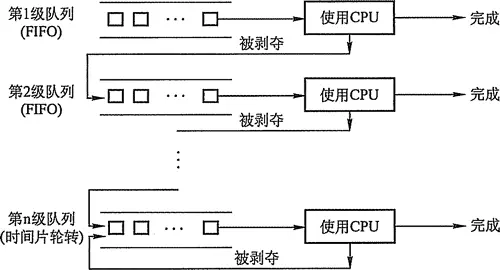
    1. 按照先来先服务原则排序，设置N个就绪队列为Q1，Q2…QN，每个队列中都可以放很多作业；
    2. 为这N个就绪队列赋予不同的优先级，第一个队列的优先级最高，第二个队列次之，其余各队列的优先权逐个降低；
    3. 设置每个就绪队列的时间片，优先权越高，算法赋予队列的时间片越小。时间片大小的设定按照实际作业（进程）的需要调整；
    4. 进程在进入待调度的队列等待时，首先进入优先级最高的Q1等待。
    5. 首先调度优先级高的队列中的进程。若高优先级中队列中已没有调度的进程，则调度次优先级队列中的进程。例如：Q1,Q2,Q3三个队列，只有在Q1中没有进程等待时才去调度Q2，同理，只有Q1,Q2都为空时才会去调度Q3。
    6. 对于同一个队列中的各个进程，按照 ( 时间片轮转法调度 )。比如Q1队列的时间片为N，那么Q1中的作业在经历了时间片为N的时间后，若还没有完成，则进入Q2队列等待，若Q2的时间片用完后作业还不能完成，一直进入下一级队列，直至完成。
    7. 在低优先级的队列中的进程在运行时，又有新到达的作业，那么在运行完这个时间片后，CPU马上分配给新到达的作业即**抢占式调度CPU**。

***
## 四、同步与互斥
*“会赢的吗？会赢的，毕竟我可是最强啊。”*
**互斥**：是指散布在不同进程之间的若干程序片段，当某个进程执行其中的一个程序片段时，其他进程就不能运行它们之中的任一程序片段，只能等到该进程运行完之后才可以继续运行。

**同步**：是指散布在不同进程之间的若干程序片段，它们的运行必须严格按照一定的先后次序来运行，这种次序依赖于要完成的任务。比如数据的收发，必须发送方发送了接收方才能收。

**临界资源**: 临界资源是一次仅允许一个进程使用的共享资源。各进程采取互斥的方式，实现共享的资源称作临界资源。属于临界资源的硬件有，打印机，磁带机等；软件有消息队列，变量，数组，缓冲区等。诸进程间采取互斥方式，实现对这种资源的共享。

**临界区**：每个进程中访问临界资源的那段代码称为临界区（criticalsection），每次只允许一个进程进入临界区，进入后，不允许其他进程进入。不论是硬件临界资源还是软件临界资源，多个进程必须互斥的对它进行访问。多个进程涉及到同一个临界资源的的临界区称为相关临界区。使用临界区时，一般不允许其运行时间过长，只要运行在临界区的线程还没有离开，其他所有进入此临界区的线程都会被挂起而进入等待状态，并在一定程度上影响程序的运行性能。

### 临界区资源互斥的方法
#### 1.原则
1. 空闲让进 临界区空闲时可以允许进程进入。
2. 忙则等待 临界区有进程则等待。
3. 有限等待 防止无限等待
4. 让权等待 进程不能进入临界区，释放处理器。

#### 2.方法
1. **单标志法（违背空闲让进）**
规定turn = 0 时，允许P0访问临界区；turn = 1 时，允许P1访问临界区。
缺点：
    1. 只能由两个进程共用一个标质量，无法完成多个进程互斥
    2. 两个进程必须交替进入临界区，若P1进入临界区并退出将turn=0，之后P0一直未进入临界区，那么由于turn1!=1,所以P1再次向进入临界区的时候就会被一直阻塞。
2.  **双标志先检查法（违背忙则等待）**
设两个进程P0和P1，以及两个标志量（flag0、flag1）。先检查对方是否正在临界区，若对方没有正在访问临界区，则自己进入临界区。
缺点：
P0，P1可能同时进入临界区。
3.  **双标志后检查法（违背空闲让进、有限等待）**
先设置自己的标志、再检查对方的标志，若对方为TRUE，则等待。
4.  **Peterson’s Alogorithm(皮特森算法)**
设一个flag数组和一个标志量（turn）.谦让方表示自己想进入临界区（假设进程i为谦让方，则将flag[i] = true），然后将临界区的进入权让给别人（假设进程j为被谦让方，则将turn = j）。自己模拟一下就会发现先谦让方将先进入临界区，后谦让方将后进入临界区。
5.  **互斥锁**
进入临界区前必须获得钥匙、否则不能进入。
6. **信号量**
P（wait函数）和V（signal函数）实现。

### 经典信号量问题。

#### 1.生产者问题

一组生产者进程和一组消费者进程共享一个初始为空、大小为 n 的缓冲区，只有缓冲区没满时，生产者才把消息放入缓冲区，否则必须等待；只有缓冲区不空时，消费者才能从中读取消息，否则必须等待。由于缓冲区是临界资源，它只允许一个生产者放入消息，或一个消费者从中取出消息。
**关系分析**：
生产者和消费者对缓冲区的访问属于互斥关系，而针对“消息”则生产者和消费者属于协作关系，只有生产者生产了消息，消费者才能使用消息，因此又是同步关系。
```C
	seamphore mutex=1;    //临界区互斥信号量
	seamphore empty=n;  //空闲缓冲区
	seamphore full=0;    // 缓冲区初始化为空
	producer(){                // 生产者进程
		while(1){
			produce an item in nextp;   // 生产数据
			P(empty);（用什么，p一下）// 获取空缓冲区单元
			P(mutex);（互斥夹紧）  // 进入临界区
			add nextp to buffer;  （行为）//将数据放入缓冲区
			V(mutex);（互斥夹紧）  // 离开临界区，释放互斥信号量
			V(full);（提供什么，V一下）//满缓冲区数加1
		}
	}
	consumer(){      //消费者进程
		while(1){
			P(full);    //获取满缓冲区单元
			P(mutex);  //进入临界区
			remove an item from buffer;  // 从缓冲区取出数据
			V(mutex);    // 离开临界区，释放互斥信号量
			V(empty);    // 空缓冲区数加 1
			consume the item;   //消费数据
		}
	}

```
#### 2.橘子、苹果
桌子上有一个盘子，每次只能向其中放入一个水果。爸爸专向盘子中放苹果，妈妈专向盘子中放橘子，儿子专吃盘子中的橘子，女儿专等吃盘子中的苹果。只有盘子为空时，爸爸或妈妈才可以向盘子中放一个水果；仅当盘子中有自己需要的水果时，儿子或女儿可以从盘子中取出。
**关系分析**：
爸爸和妈妈是互斥关系，爸爸和女儿、妈妈和儿子是同步关系，而且这两对进程必须连起来，儿子和女儿之间没有互斥和同步关系，因为他们是选择条件执行。

```C
	semaphore plate=1,apple=0,orange=0;
	dad(){
		while(1){
			prepare an apple;
			P(plate);   //互斥向盘中取、放水果
			put the apple on the plate;  //向盘中放苹果
			V(apple);   // 允许取苹果
		}
	}
	mom(){
		while(1){
			prepare an orange;
			P(plate);
			put the orange on the plate;
			V(orange);
		}
	}
	son(){
		while(1){
			P(orange);  //互斥从盘中取橘子
			take an orange from the plate;
			V(plate);  //允许向盘中放、取水果
			eat the orange;
		}
	}
	daughter(){
		while(1){
			P(apple);
			take an aplle from the plate;
			V(plate);
			eat the apple;
		}
	}

```

### 3.读者-写者问题
有读者和写者两组并发进程，共享一个文件，当两个或两个以上的读进程同时访问共享数据时不会产生副作用，但若某个写进程和其他进程同时访问共享数据时则可能导致数据不一致的错误，因此：
① 允许多个读者可以同时对文件执行读操作；
② 只允许一个写者往文件中写信息；
③ 任一写者在完成写操作之前不允许其他读者进程或写者工作；
④ 写者执行写操作前，应让已有的读者和写者全部退出。
```C++
	int count=0;
	semaphore mutex=1;
	semaphore rw=1;
	semaphore w=1; // 实现写者优先
	writer(){
		while(1){
			P(w);  // 在无写进程请求时进入
			P(rw);   // 互斥访问共享文件
			writing
			V(rw); // 释放共享文件
			V(w);   // 恢复对共享文件的访问
		}
	}
	reader(){
		while(1){
			P(w);  
			P(mutex);   // 互斥访问 count 变量
			if(count==0)  // 当第一个读进程读共享文件时
				P(rw)  // 阻止写进程
			count++;
			V(mutex);   // 释放互斥变量 count
			V(w);
			reading;
			P(mutex); 
			count--;
			if(count==0)   // 当最后一个读进程读完共享文件
				V(rw);  // 允许写进程写
			V(mutex);
		}
	}
```
### 4.哲学家进餐问题
一张圆桌上坐着5名哲学家，每两名哲学家之间的桌子上摆着一根筷子，两根筷子之间是一碗米饭。哲学家倾注毕生精力于思考和进餐，哲学家思考时不影响其他人。只有当哲学家饥饿时，才试图拿起左、右两根筷子——一根一根地拿起。若筷子已在他人手上，则需要等待。饥饿地哲学家只有同时拿到了两根筷子才能开始进餐，进餐完毕，放下筷子继续思考。
1）5 名哲学家与左右邻座对其中间的筷子的访问时互斥关系。
2）思路整理：显而易见，5 个哲学家对应5 个进程，问题解决的关键就是如何让一名哲学家拿到左右两根筷子而不造成死锁或饥饿现象。解决方法有两个：一是让他们同时拿两根筷子；二是对每名哲学家的动作制定规则，避免饥饿或死锁现象的发生。
3）信号量设置：互斥信号量数组 chopstick[5]={1,1,1,1,1}，用于对 5 个筷子的互斥访问；哲学家编号顺序：0~4，哲学家 I 左边筷子的编号为 i，哲学家右边筷子的编号为(i+1)%5。
```C++
	semaphore chopstick[5]={1,1,1,1,1};
	semaphore mutex=1;
	Pi(){
		do{
			P(mutex);  // 在取筷子前获得互斥量
			P(chopstick[i]);  //取左边筷子
			P(chopstick[(i+1)%5]);// 取右边筷子
			V(mutex);  // 释放取筷子的信号量
			eat;
			V(chopstick[i]);  //放回左边筷子
			V(chopstick[(i+1)%5]);// 放回右边筷子
			think;
		}while(1);
	}
```
### 管程
作用: 简化pv操作,管理进程
结构:
	- 名称
	- 共享数据结构说明
	- 对数据结构进行操作的一组过程
	- 对局部管程内部的共享数据设置初始值的语句
本质就是对数据的插入和获取进行的源语 wait和signal的管理。管程也默认互斥，所以简化了程序员的负担。
***
## 五、死锁
*"All tragedy erased. I see only wonders..."*
*“我遗忘了所有的悲剧，只留下一个个璀璨闪亮的奇迹。”*
### 概念
**死锁（Deadlock）**：是指两个或两个以上的进程在执行过程中，因争夺资源而造成的一种互相等待的现象，若无外力作用，它们都将无法推进下去。称此时系统处于死锁状态或系统产生了死锁。
称这些永远在互相等待的进程为死锁进程。
所占用的资源或者需要它们进行某种合作的其它进程就会相继陷入死锁，最终可能导致整个系统处于瘫痪状态。  

**死锁的条件**
1. 根本条件：资源不足和进程顺序不当
2. 必要条件：
	1. 互斥条件。某段时间资源为一个进程独有。
	2. 不可剥夺条件。自己释放自己的资源。
	3. 请求并保持条件。已经有一个资源，还想要一个资源。
	4. 循环等待条件。有个圈。A-->B-->C-->A,互相等着对方的资源。
### 死锁处理
1. 死锁预防。破坏四个死锁条件。
	1. 破坏互斥条件。
	2. 破坏不可剥夺。
	3. 破坏请求保持条件。使用完毕的资源必须释放后才能获取新的资源。
	4. 破坏循环等待条件。只能获取比自己大的序号的资源。
2. **避免死锁**。动态避免死锁。
	在避免死锁的方法中，把系统的状态分为两种：**安全状态**（是指系统能按某种顺序如<P1,P2,…,Pn>(称<P1,P2,…Pn>序列为安全序列)，来为每个进程分配其所需资源，直到最大需求，使每个进程都可顺序完成。）和不安全状态，当系统处于安全状态时，可以避免死锁的发生，反之，当系统处于不安全状态时，可能导致死锁的发生。
	**银行家算法（详情看例题）**
	1. 可利用资源向量Avaliable。这是一个含有m个元素的数组，其中每一个元素代表一类可利用的资源数目，其初始值是系统所配置的该类全部可用资源的数目，其中的每一个元素代表一类可利用的资源数目，其初始值是系统中所配置的该类全部可用资源的数目，其数值随该类资源的分配和回收而动态的改变。如果Available[j]=K，则表示系统中现有Rj类资源的最大数目为K。

	2. 最大需求矩阵Max。是一个n×m的矩阵，定义了系统中n个进程中的每一个进程对m类资源的最大需求。如果Max[i, j]=K，则表示进程i需要Rj类资源的最大数目为K。

	3. 分配矩阵Allocation。是一个n×m的矩阵，定义了系统中每一类资源当前已分配给每一进程的资源数。如果Allocation[i, j]=K，则表示进程i当前已分得Rj类资源的数目为K。

	4. 需求矩阵Need。是一个n×m的矩阵，用以表示每一个进程尚需的各类资源数。如果Need[i, j]=K，则表示进程i还需要Rj类资源K个方能完成其任务。
	它们之间的关系为:　　
	<div align="center"><b>Need[i, j] = Max[i, j] -Allocation[i, j]</b></div>
	
	**银行家算法例题：**
	<!-- 模拟的表格标题行，其中"Available"跨越多列 -->  
	|    |   |  |   |   |   |   |   |   |   |
	|:---:|:---:|:---:|:---:|:---:|:---:|:---:|:---:|:---:|:---:|
	|    | A | B | C | A | B | C | A | B | C |
	| p0 | 7 | 5 | 3 | 0 | 1 | 0 | 3 | 3 | 2 |
	| p1 | 3 | 2 | 2 | 2 | 0 | 0 |   |   |   |
	| p2 | 9 | 0 | 2 | 3 | 0 | 2 |   |   |   |
	| p3 | 2 | 2 | 2 | 2 | 1 | 1 |   |   |   |
	| p4 | 4 | 3 | 3 | 0 | 0 | 2 |   |   |   |
	
	前三个ABC是MAX,ALLOCATION,AVAILABLE.
	使用矩阵减法：MAX[i]-ALLOCATED[I] = NEED[i]得到NEED矩阵。与剩余AVAILABLE比较，可以知道一个安全顺序。
	p1,p3,p4,p2,p0.
  
<!-- 注意：Markdown本身不支持合并单元格，这里使用空格和对齐来模拟"Available"跨越多列 -->
3. **死锁检测**。
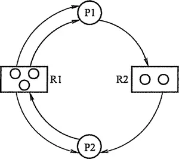
在资源分配图中，找出既不阻塞又非独立的进程结点Pi，在顺利的情况下，Pi可以得到所需的资源而继续运行，直至完成，然后释放它所占有的所有资源。这相当于消去它所有的请求边和分配边，使之称为孤立的结点。
进程Pi所释放的资源，可以唤醒某些因等待这些资源而阻塞的进程，原来的阻塞进程可能变为非阻塞进程。然后重复上面的过程，消去请求边和分配边。
若能消去图中所有的边，使得图中的进程结点变为孤立点，则称该图是可完全简化的，否则称该图是不可完全简化的。不可简化的图则存在死锁。
4. **死锁删除**。
	1. 挂起某些进程。剥夺资源。
	2. 撤销部分进程。
	3. 进程回退。
***
## 六、内存管理
*“Survival or destruction, this is a question worth considering.”*


内存管理(Memory Management)是操作系统设计中最重要和最复杂的内容之一。
虽然计算机硬件一直在飞速发展，内存容量也在不断增长，但是仍然不可能将所有用户进程和系统所需要的全部程序和数据放入主存中，所以操作系统必须将内存空间进行合理地划分和有效地动态分配。
操作系统对内存的划分和动态分配，就是内存管理的概念。
有效的内存管理在多道程序设计中非常重要，不仅方便用户使用存储器、提高内存利用率，还可以通过虚拟技术从逻辑上扩充存储器。

### 功能

内存管理的功能有：

1. 内存空间的分配与回收：由操作系统完成主存储器空间的分配和管理，使程序员摆脱存储分配的麻烦，提高编程效率。
2. 地址转换：在多道程序环境下，程序中的逻辑地址与内存中的物理地址不可能一致，因此存储管理必须提供地址变换功能，把逻辑地址转换成相应的物理地址。
3. 内存空间的扩充：利用虚拟存储技术或自动覆盖技术，从逻辑上扩充内存。
4. 存储保护：保证各道作业在各自的存储空间内运行，互不干扰。

### 程序装入和链接
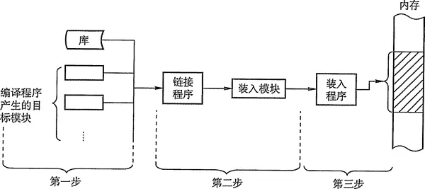
将用户源程序变为可在内存中执行的程序，通常需要以下几个步骤：
编译：由编译程序将用户源代码编译成若干个目标模块。
链接：由链接程序将编译后形成的一组目标模块，以及所需库函数链接在一起，形成一个完整的装入模块。
装入：由装入程序将装入模块装入内存运行。

#### 链接方式
静态链接：在程序运行之前，先将各目标模块及它们所需的库函数链接成一个完整的可执行程序，以后不再拆开。

装入时动态链接：将用户源程序编译后所得到的一组目标模块，在装入内存时，釆用边装入边链接的链接方式。

运行时动态链接：对某些目标模块的链接，是在程序执行中需要该目标模块时，才对它进行的链接。其优点是便于修改和更新，便于实现对目标模块的共享。

#### 装入模式
1) 绝对装入。

	在编译时，如果知道程序将驻留在内存的某个位置，编译程序将产生绝对地址的目标代码。绝对装入程序按照装入模块中的地址，将程序和数据装入内存。由于程序中的逻辑地址与实际内存地址完全相同，故不需对程序和数据的地址进行修改。

	绝对装入方式只适用于单道程序环境。另外，程序中所使用的绝对地址,可在编译或汇编时给出，也可由程序员直接赋予。而通常情况下在程序中釆用的是符号地址，编译或汇编时再转换为绝对地址。

2) 可重定位装入。

	在多道程序环境下，多个目标模块的起始地址通常都是从0开始，程序中的其他地址都是相对于起始地址的,此时应釆用可重定位装入方式。

	根据内存的当前情况，将装入模块装入到内存的适当位置。装入时对目标程序中指令和数据的修改过程称为重定位，地址变换通常是在装入时一次完成的，所以又称为静态重定位，

3) 动态运行时装入，也称为动态重定位，程序在内存中如果发生移动，就需要釆用动态的装入方式。

	装入程序在把装入模块装入内存后，并不立即把装入模块中的相对地址转换为绝对地址，而是把这种地址转换推迟到程序真正要执行时才进行。

### 连续内存分配管理方式

1. **单一连续分配**
内存在此方式下分为系统区和用户区，系统区仅提供给操作系统使用，通常在低地址部分；用户区是为用户提供的、除系统区之外的内存空间。
这种方式无需进行内存保护。
这种方式的优点是简单、无外部碎片，可以釆用覆盖技术，不需要额外的技术支持。
缺点是只能用于单用户、单任务的操作系统中，有内部碎片，存储器的利用率极低。

2. **固定分区分配**
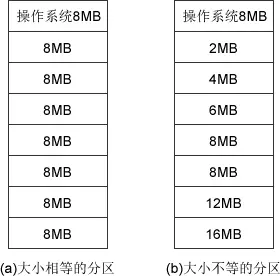
固定分区分配是最简单的一种多道程序存储管理方式，它将用户内存空间划分为若干个固定大小的区域，每个分区只装入一道作业。
当有空闲分区时，便可以再从外存的后备作业队列中,选择适当大小的作业装入该分区，如此循环。
固定分区分配在划分分区时，有两种不同的方法。
分区大小相等：用于利用一台计算机去控制多个相同对象的场合，缺乏灵活性。
分区大小不等：划分为含有多个较小的分区、适量的中等分区及少量的大分区。
这种分区方式存在两个问题：一是程序可能太大而放不进任何一个分区中，这时用户不得不使用覆盖技术来使用内存空间；二是主存利用率低，当程序小于固定分区大小时，也占用了一个完整的内存分区空间，这样分区内部有空间浪费，这种现象称为内部碎片。

3. **动态分区分配**
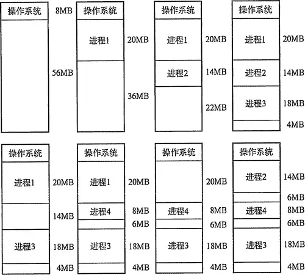
动态分区分配又称为可变分区分配，是一种动态划分内存的分区方法。 这种分区方法不预先将内存划分，而是在进程装入内存时，根据进程的大小动态地建立分区，并使分区的大小正好适合进程的需要。 因此系统中分区的大小和数目是可变的。 动态分区在开始分配时是很好的，但是之后会导致内存中出现许多小的内存块。 随着时间的推移，内存中会产生越来越多的碎片。内存的利用率随之下降。这些小的内存块称为外部碎片，指在所有分区外的存储空间会变成越来越多的碎片，这与固定分区
中的内部碎片正好相对。 有以下动态分配算法:
	1.首次适应(First Fit)算法：空闲分区以地址递增的次序链接。分配内存时顺序查找，**找到大小能满足要求的第一个空闲分区**。首次适应算法会使得内存的低地址部分出现很多小的空闲分区，而每次分配查找时，都要经过这些分区，因此也增加了查找的开销。
	2. 最佳适应(Best Fit)算法：空闲分区按容量递增形成分区链，找到 **第一个能满足要求的空闲分区**。因为每次最佳的分配会留下很小的难以利用的内存块，它会产生最多的外部碎片。
	3. 最坏适应(Worst Fit)算法：又称最大适应(Largest Fit)算法，空闲分区以容量递减的次序链接。找到第一个能满足要求的空闲分区，也就是 **挑选出最大的分区**。

### 内存非连续分配管理方式
*“绝对的强者，由此而生的孤独，教会你爱的是————————分页机制！”*
非连续分配允许一个程序分散地装入到不相邻的内存分区中，根据分区的大小是否固定分为分页存储管理方式和分段存储管理方式。 分页存储管理方式中，又根据运行作业时是否要把作业的所有页面都装入内存才能运行分为基本分页存储管理方式和请求分页存储管理方式。 下面介绍基本分页存储管理方式。

#### 基本分页机制
*“你才是挑战者，分页机制”*
##### 基本概念
1. 地址结构由两部分组成：页号P和页内偏移量W。 我们以32位机举例。物理地址由32位0/1组成。一般而言，一页大小是4KB，也就是说，页内偏移量仅需12位，剩下20位可以表示具体的页号。因此可以表示
如下个页面：$$ 2^{20} $$
2. 页表。为了便于在内存中找到进程的每个页面所对应的物理块，系统为每个进程建立一张页表，记录页面在内存中对应的物理块号，页表一般存放在内存中。页表的作用是实现从页号到物理块号的地址映射。
3. 快表。若页表全部放在内存中，则存取一个数据或一条指令至少要访问两次内存：一次是访问页表，确定所存取的数据或指令的物理地址，第二次才根据该地址存取数据或指令。 显然，这种方法比通常执行指令的速度慢了一半。 为此，在地址变换机构中增设了一个具有并行查找能力的高速缓冲存储器——快表，又称联想寄存器(TLB)，用来存放当前访问的若干页表项，以加速地址变换的过程。 在具有快表的分页机制中，地址的变换过程：
	1. CPU给出逻辑地址后，由硬件进行地址转换并将页号送入高速缓存寄存器，并将此页号与快表中的所有页号进行比较。 如果找到匹配的页号，说明所要访问的页表项在快表中，则直接从中取出该页对应的页框号，与页内偏移量拼接形成物理地址。这样，存取数据仅一次访存便可实现。
	2. 如果没有找到，则需要访问主存中的页表，在读出页表项后，应同时将其存入快表，以便后面可能的再次访问。但若快表已满，则必须按照一定的算法对旧的页表项进行替换。 注意：有些处理机设计为快表和慢表同时查找，如果在快表中查找成功则终止慢表的查找。一般快表的命中率可以达到90%以上，这样，分页带来的速度损失就降低到10%以下。快表的有效性是基于著名的局部性原理，这在后面的虚拟内存中将会具体讨论。
##### 基本地址变换机构
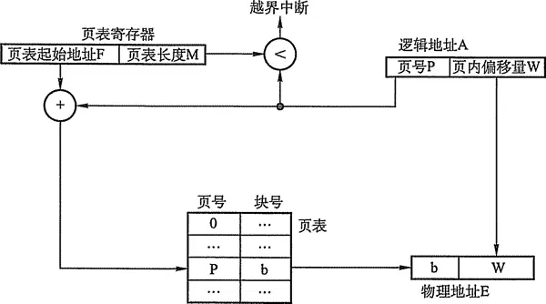
在系统中通常设置一个页表寄存器(PTR)，存放页表在内存的始址F和页表长度M。 进程未执行时，页表的始址和长度存放在进程控制块中，当进程执行时，才将页表始址和长度存入页表寄存器。设页面大小为L，逻辑地址A到物理地址E的变换过程如下： 计算页号P(P=A/L)和页内偏移量W (W=A%L)。 比较页号P和页表长度M，若P>= M，则产生越界中断，否则继续执行。 页表中页号P对应的页表项地址 = 页表起始地址F + 页号P * 页表项长度，取出该页表项内容b，即为物理块号。 计算 $$E=bL+W$$ ，用得到的物理地址E去访问内存。 以上整个地址变换过程均是由硬件自动完成的。 例如，若页面大小L为1K字节，页号2对应的物理块为b=8，计算逻辑地址A=2500 的物理地址E的过程如下：P=2500/1K=2，W=2500%1K=452，查找得到页号2对应的物理块的块号
为 8，E=81024+452=8644。

##### 二级页表
*“Ciallo～(∠・ω< )⌒☆”*
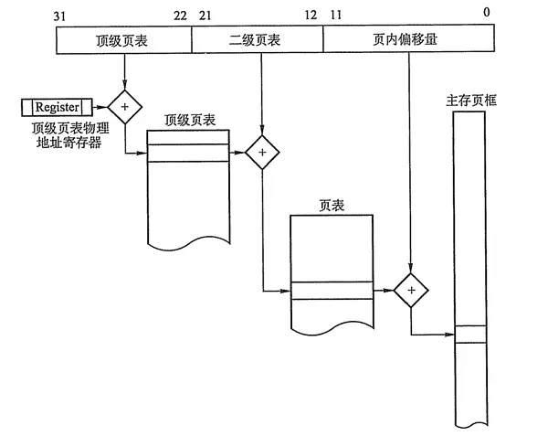
为什么要二级页表？ 以32 位逻辑地址空间、页面大小4KB、页表项大小4B为例，若要实现进程对全部逻辑地址空间的映射，页面大小需要12位，有2^20个页面数量，如果把他们全部放到页表中，会有: $$ 4B*2^{20}/4KB$$ 页，即连续的1K页。这是不能接受的。 将页表映射的思想进一步延伸，就可以得到二级分页：将页表的10页空间也进行地址映射，建立上一级页表，用于存储页表的映射关系。这里对页表的10个页面进行映射只需要10个页表项，所以上一级页表只需要1页就足够（可以存储2^10=1024个页表项）。在进程执行时，只需要将这1页的上一级页表调入内存即可，进程的页表和进程本身的页面，可以在后面的执行中再i周入内存。

#### 基本分段机制
*连一刻都没有为分页机制的死亡而哀悼，现在赶到战场的是分段机制！！！！！！！*
分页管理方式是从计算机的角度考虑设计的，以提高内存的利用率，提升计算机的性能, 且分页通过硬件机制实现，对用户完全透明；
而分段管理方式的提出则是考虑了用户和程序员，以满足方便编程、信息保护和共享、动态增长及动态链接等多方面的需要。
##### 分段
段式管理方式按照用户进程中的自然段划分逻辑空间。例如，用户进程由主程序、两个子程序、栈和一段数据组成，于是可以把这个用户进程划分为5个段，每段从0 开始编址，并分配一段连续的地址空间（段内要求连续，段间不要求连续，因此整个作业的地址空间是二维的）。
其逻辑地址由段号S与段内偏移量W两部分组成。
段号为16位，段内偏移量为16位，则一个作业最多可有216=65536个段，最大段长为64KB。

##### 段表
每个进程都有一张逻辑空间与内存空间映射的段表，其中每一个段表项对应进程的一个段，段表项记录该段在内存中的起始地址和段的长度。
| 段号 | 段长 | 本段所在主存的始址 |
|----|----|-----------|
##### 地址变换机构
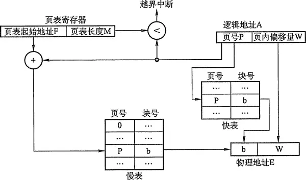
为了实现进程从逻辑地址到物理地址的变换功能，在系统中设置了段表寄存器，用于存放段表始址F和段表长度M。其从逻辑地址A到物理地址E之间的地址变换过程如下： 从逻辑地址A中取出前几位为段号S，后几位为段内偏移量W。 比较段号S和段表长度M，若S多M，则产生越界中断，否则继续执行。 段表中段号S对应的段表项地址 = 段表起始地址F + 段号S * 段表项长度，取出该段表项的前几位得到段长C。若段内偏移量>=C，则产生越界中断，否则继续执行。 取出段表项中该段的起始地址b，计算 E = b + W，用得到的物理地址E去访问内存。


### 虚拟内存管理
#### 概念
要真正理解虚拟内存技术的思想，首先必须了解计算机中著名的局部性原理。

著名的 Bill Joy (SUN公司CEO)说过：”在研究所的时候，我经常开玩笑地说高速缓存是计算机科学中唯一重要的思想。事实上，髙速缓存技术确实极大地影响了计算机系统的设计。“快表(TLB)、 页高速缓存以及虚拟内存技术从广义上讲，都是属于高速缓存技术。这个技术所依赖的原理就是局部性原理。局部性原理既适用于程序结构，也适用于数据结构（更远地讲，Dijkstra 著名的关于“goto语句有害”的论文也是出于对程序局部性原理的深刻认识和理解）。

局部性原理表现在以下两个方面：

**时间局部性**：如果程序中的某条指令一旦执行，不久以后该指令可能再次执行；如果某数据被访问过，不久以后该数据可能再次被访问。产生时间局部性的典型原因，是由于在程序中存在着大量的循环操作。

**空间局部性**：一旦程序访问了某个存储单元，在不久之后，其附近的存储单元也将被访问，即程序在一段时间内所访问的地址，可能集中在一定的范围之内，这是因为指令通常是顺序存放、顺序执行的，数据也一般是以向量、数组、表等形式簇聚存储的。

#### 定义和特征
*“只要不断前进就好了……只要不停下来……道路就会不断延伸……（ki bo mo ha la～）”*
基于局部性原理，在程序装入时，可以将程序的一部分装入内存，而将其余部分留在外存，就可以启动程序执行。
在程序执行过程中，当所访问的信息不在内存时，由操作系统将所需要的部分调入内存,然后继续执行程序。
另一方面，操作系统将内存中暂时不使用的内容换出到外存上，从而腾出空间存放将要调入内存的信息。
这样，系统好像为用户提供了一个比实际内存大得多的存储器，称为虚拟存储器。
之所以将其称为虚拟存储器，是因为这种存储器实际上并不存在，只是由于系统提供了部分装入、请求调入和置换功能后（对用户完全透明），给用户的感觉是好像存在一个比实际物理内存大得多的存储器。

虚拟存储器的大小由计算机的地址结构决定，并非是内存和外存的简单相加。虚拟存储器有以下三个主要特征：
1. **多次性**，是指无需在作业运行时一次性地全部装入内存，而是允许被分成多次调入内存运行。
2. **对换性**，是指无需在作业运行时一直常驻内存，而是允许在作业的运行过程中，进行换进和换出。
3. **虚拟性**，是指从逻辑上扩充内存的容量，使用户所看到的内存容量，远大于实际的内存容量。

虚拟内存的实需要建立在离散分配的内存管理方式的基础上。虚拟内存的实现有以下三种方式：
1. 请求分页存储管理。
2. 请求分段存储管理。
3. 请求段页式存储管理。

#### 缺页中断机构
在请求分页系统中，每当所要访问的页面不在内存时，便产生一个缺页中断，请求操作系统将所缺的页调入内存。
此时应将缺页的进程阻塞(调页完成唤醒)，如果内存中有空闲块，则分配一个块，将要调入的页装入该块，并修改页表中相应页表项，若此时内存中没有空闲块，则要淘汰某页(若被淘汰页在内存期间被修改过，则要将其写回外存)。
缺页中断作为中断同样要经历，诸如保护CPU环境、分析中断原因、转入缺页中断处理程序、恢复CPU环境等几个步骤。
但与一般的中断相比，它有以下两个明显的区别：
在指令执行期间产生和处理中断信号，而非一条指令执行完后，属于内部中断。
一条指令在执行期间，可能产生多次缺页中断。

#### 页面置换算法
*“页面置换只需要恰到好处地置换页面就可以了，而用户考虑的可就多了”*
##### 1.最佳置换算法(OPT)

最佳(Optimal, OPT)置换算法所选择的被淘汰页面将是以后永不使用的，或者是在最长时间内不再被访问的页面,这样可以保证获得最低的缺页率。
但由于人们目前无法预知进程在内存下的若千页面中哪个是未来最长时间内不再被访问的，因而该算法无法实现。最佳置换算法可以用来评价其他算法。
##### 2.先进先出(FIFO)页面置换算法
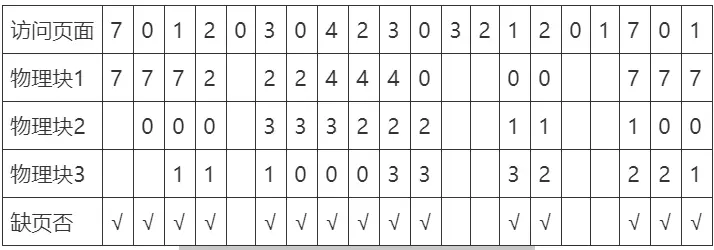
优先淘汰最早进入内存的页面，亦即在内存中驻留时间最久的页面。
该算法实现简单，只需把调入内存的页面根据先后次序链接成队列，设置一个指针总指向最早的页面。
但该算法与进程实际运行时的规律不适应，因为在进程中，有的页面经常被访问。
##### 3.最近最久未使用(LRU)置换算法
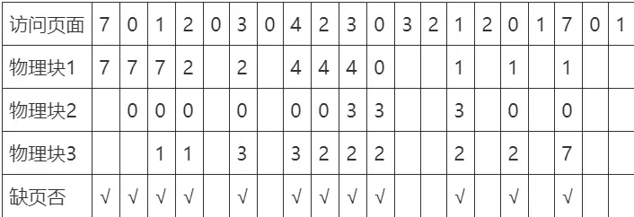
选择最近最长时间未访问过的页面予以淘汰，它认为过去一段时间内未访问过的页面，在最近的将来可能也不会被访问。
该算法为每个页面设置一个访问字段，来记录页面自上次被访问以来所经历的时间，淘汰页面时选择现有页面中值最大的予以淘汰。
##### 4.时钟(CLOCK)置换算法
当某一页首次装入主存时，该帧的使用位设置为1;当该页随后再被访问到时，它的使用位也被置为1。对于页替换算法，用于替换的候选帧集合看做一个循环缓冲区，并且有一个指针与之相关联。当某一页被替换时，该指针被设置成指向缓冲区中的下一帧。当需要替换一页时，操作系统扫描缓冲区，以查找使用位被置为0的一帧。每当遇到一个使用位为1的帧时，操作系统就将该位重新置为0；如果在这个过程开始时，缓冲区中所有帧的使用位均为0，则选择遇到的第一个帧替换；如果所有帧的使用位均为1,则指针在缓冲区中完整地循环一周，把所有使用位都置为0，并且停留在最初的位置上，替换该帧中的页。
由于该算法循环地检查各页面的情况，故称为CLOCK算法，又称为最近未用(Not Recently Used, NRU)算法。
##### 5.改进型的 clock 算法
CLOCK算法的性能比较接近LRU，而通过增加使用的位数目，可以使得CLOCK算法更加高效。在使用位的基础上再增加一个修改位，则得到改进型的CLOCK置换算法。这样，每一帧都处于以下四种情况之一：
```
理想页面置换顺序。
1. 最近未被访问，也未被修改(u=0, m=0)。
2. 最近未被访问，但被修改(u=0, m=1)。 
3. 最近被访问，但未被修改(u=1, m=0)。
4. 最近被访问，被修改(u=1, m=1)。
```
#### 页面分配策略
驻留集：分配给进程的页面数量。
驻留集分配策略如下：
1. 固定分配局部置换
它为每个进程分配一定数目的物理块，在整个运行期间都不改变。若进程在运行中发生缺页，则只能从该进程在内存中的页面中选出一页换出，然后再调入需要的页面。
实现这种策略难以确定为每个进程应分配的物理块数目：太少会频繁出现缺页中断，太多又会使CPU和其他资源利用率下降。
2. 可变分配全局置换
这是最易于实现的物理块分配和置换策略，为系统中的每个进程分配一定数目的物理块,操作系统自身也保持一个空闲物理块队列。
当某进程发生缺页时，系统从空闲物理块队列中取出一个物理块分配给该进程，并将欲调入的页装入其中。
3. 它为每个进程分配一定数目的物理块，当某进程发生缺页时，只允许从该进程在内存的页面中选出一页换出，这样就不会影响其他进程的运行。
如果进程在运行中频繁地缺页，系统再为该进程分配若干物理块，直至该进程缺页率趋于适当程度；
反之，若进程在运行中缺页率特别低，则可适当减少分配给该进程的物理块。

#### 页面调入时机
1. 预调页策略
根据局部性原理，一次调入若干个相邻的页可能会比一次调入一页更高效
但如果调入的一批页面中大多数都未被访问，则又是低效的。所以就需要釆用以预测为基础的预调页策略，将预计在不久之后便会被访问的页面预先调入内存。但目前预调页的成功率仅约50%。故这种策略主要用于进程的首次调入时，由程序员指出应该先调入哪些页。
2. 请求调页策略
进程在运行中需要访问的页面不在内存而提出请求，由系统将所需页面调入内存。由这种策略调入的页一定会被访问，且这种策略比较易于实现，故在目前的虚拟存储器中大多釆用此策略。它的缺点在于每次只调入一页，调入调出页面数多时会花费过多的I/O开销。
#### 页面抖动(颠簸)和工作集
*“Lights will guide you home,and ignite your bones.”*
##### 页面抖动
在页面置换过程中的一种最糟糕的情形是，刚刚换出的页面马上又要换入主存，刚刚换入的页面马上就要换出主存，这种频繁的页面调度行为称为抖动，或颠簸。
如果一个进程在换页上用的时间多于执行时间，那么这个进程就在颠簸。
频繁的发生缺页中断（抖动），其主要原因是某个进程频繁访问的页面数目高于可用的物理页帧数目。
虚拟内存技术可以在内存中保留更多的进程以提髙系统效率。在稳定状态，几乎主存的所有空间都被进程块占据，处理机和操作系统可以直接访问到尽可能多的进程。
但如果管理不当，处理机的大部分时间都将用于交换块，即请求调入页面的操作，而不是执行进程的指令，这就会大大降低系统效率。
**解决办法**：撤销部分进程。
##### 工作集
工作集（或驻留集）是指在某段时间间隔内，进程要访问的页面集合。
经常被使用的页面需要在工作集中，而长期不被使用的页面要从工作集中被丢弃。为了防止系统出现抖动现象，需要选择合适的工作集大小。
工作集模型的原理是：让操作系统跟踪每个进程的工作集，并为进程分配大于其工作集的物理块。
如果还有空闲物理块，则可以再调一个进程到内存以增加多道程序数。如果所有工作集之和增加以至于超过了可用物理块的总数，那么操作系统会暂停一个进程，将其页面调出并且将其物理块分配给其他进程，防止出现抖动现象。
正确选择工作集的大小，对存储器的利用率和系统吞吐量的提嵩，都将产生重要影响。

***
## 七、文件管理
*“生命本就没有意义。任何事物都会经历四个阶段：创建、兴起、衰退、消亡。生命如此、人类如此，太阳系亦如此。但这并不意味着我会消沉。在如烟花绽放般短暂的时间片段里，享受着时间的馈赠，这已经足够让我感到幸福了。嗯，我想，就好像明知道猫会有一天离去，仍然会选择照顾一样。知道终点，会让我珍惜现在。“真的吗？”“至少我希望是。””*

### 概念和定义
文件(File)是操作系统中的一个重要概念。
在系统运行时，计算机以进程为基本单位进行资源的调度和分配；而在用户进行的输入、输出中，则以文件为基本单位。
大多数应用程序的输入都是通过文件来实现的，其输出也都保存在文件中，以便信息的长期存及将来的访问。
当用户将文件用于应用程序的输入、输出时，还希望可以访问文件、修改文件和保存文件等，实现对文件的维护管理，这就需要系统提供一个文件管理系统，操作系统中的文件系统(File System)就是用于实现用户的这些管理要求。
从用户的角度看，文件系统是操作系统的重要部分之一。用户关心的是如何命名、分类和查找文件，如何保证文件数据的安全性以及对文件可以进行哪些操作等。而对其中的细节，如文件如何存储在辅存上、如何管理文件辅存区域等关心甚少。
文件系统提供了与二级存储相关的资源的抽象，让用户能在不了解文件的各种属性、文件存储介质的特征以及文件在存储介质上的具体位置等情况下，方便快捷地使用文件。
用户通过文件系统建立文件，提供应用程序的输入、输出，对资源进行管理。
首先了解文件的结构，我们通过自底向上的方式来定义。
1) 数据项
**数据项是文件系统中最低级的数据组织形式**，可分为以下两种类型：
基本数据项：用于描述一个对象的某种属性的一个值，如姓名、日期或证件号等，是数据中可命名的最小逻辑数据单位，即原子数据。
组合数据项：由多个基本数据项组成。
2) 记录
**记录是一组相关的数据项的集合**，用于描述一个对象在某方面的属性，如一个考生报名记录包括考生姓名、出生日期、报考学校代号、身份证号等一系列域。
3) 文件
**文件是指由创建者所定义的一组相关信息的集合，逻辑上可分为有结构文件和无结构文件两种**。
在有结构文件中，文件由一组相似记录组成，如报考某学校的所有考生的报考信息记录，又称记录式文件；而无结构文件则被看成是一个字符流，比如一个二进制文件或字符文件，又称流式文件。
虽然上面给出了结构化的表述，但实际上关于文件并无严格的定义。通常在操作系统中将程序和数据组织成文件。
文件可以是数字、字母或二进制代码，基本访问单元可以是字节、 行或记录。
文件可以长期存储于硬盘或其他二级存储器中,允许可控制的进程间共享访问，能够被组织成复杂的结构。

### 文件的逻辑结构
无结构文件(流式文件)和有结构文件(记录式文件)。
#### 无结构文件（流式文件）
无结构文件是最简单的文件组织形式。
无结构文件将数据按顺序组织成记录并积累保存，它是有序相关信息项的集合，以字节(Byte)为单位。
由于无结构文件没有结构，因而对记录的访问只能通过穷举搜索的方式，故这种文件形式对大多数应用不适用。
但字符流的无结构文件管理简单，用户可以方便地对其进行操作。
所以，那些对基本信息单位操作不多的文件较适于釆用字符流的无结构方式，如源程序文件、目标代码文件等。

#### 有结构文件（记录式文件）
有结构文件按记录的组织形式可以分为：
##### 顺序文件
文件中的记录一个接一个地顺序排列，记录可以是定长的或变长的，可以顺序存储或以链表形式存储，在访问时需要顺序搜索文件。顺序文件有以下两种结构：
1. 第一种是串结构，记录之间的顺序与关键字无关。通常的办法是由时间决定，即按存入时间的先后排列，最先存入的记录作为第1个记录，其次存入的为第2个记录，依此类推。
2. 第二种是顺序结构，指文件中的所有记录按关键字顺序排列。

在对记录进行批量操作时，即每次要读或写一大批记录，对顺序文件的效率是所有逻辑文件中最高的；此外，也只有顺序文件才能存储在磁带上，并能有效地工作，但顺序文件对查找、修改、增加或删除单个记录的操作比较困难。

##### 索引文件
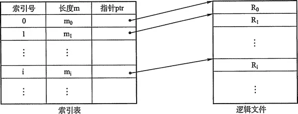
使用索引表，记录索引号和对应的物理真实地址的映射关系。变长记录文件只能顺序查找，系统开销较大。为此可以建立一张索引表以加快检索速度，索引表本身是定长记录的顺序文件。在记录很多或是访问要求高的文件中，需要引入索引以提供有效的访问。实际中，通过索引可以成百上千倍地提高访问速度。

##### 索引顺序文件
索引顺序文件是顺序和索引两种组织形式的结合。
索引顺序文件将顺序文件中的所有记录分为若干个组，为顺序文件建立一张索引表，在索引表中为每组中的第一个记录建立一个索引项，其中含有该记录的关键字值和指向该记录的指针。
### 文件控制块和索引结点

####  文件控制块
文件控制块(FCB)是用来存放控制文件需要的各种信息的数据结构，以实现“按名存取”。
FCB的有序集合称为文件目录，一个FCB就是一个文件目录项。
为了创建一个新文件，系统将分配一个FCB并存放在文件目录中，成为目录项。
FCB主要包含以下信息：
1. 基本信息，如文件名、文件的物理位置、文件的逻辑结构、文件的物理结构等。
2. 存取控制信息，如文件存取权限等。
3. 使用信息，如文件建立时间、修改时间等。

#### 索引节点
在检索目录文件的过程中，只用到了文件名，仅当找到一个目录项（查找文件名与目录项中文件名匹配）时，才需要从该目录项中读出该文件的物理地址。
也就是说，在检索目录时，文件的其他描述信息不会用到，也不需调入内存。
因此，有的系统（如UNIX）釆用了文件名和文件描述信息分开的方法，文件描述信息单独形成一个称为索引结点的数据结构，简称为 i 结点。
在文件目录中的每个目录项仅由文件名和指向该文件所对应的i结点的指针构成。

### 文件物理结构


1. 连续分配：要求每个文件在磁盘上占有一组连续的块。
2. 链接分配：如同链表一样。离散分布。指针指引下一个文件存在哪里。
3. 索引分配： 将每个文件的所有的盘块号集中地放在一起，当访问到某个文件时，将对应的盘块号一起调入内存。


### 目录结构
在理解一个文件系统的需求前，我们首先来考虑在目录这个层次上所需要执行的操作，这有助于后面文件系统的整体理解。
搜索：当用户使用一个文件时，需要搜索目录，以找到该文件的对应目录项。
创建文件：当创建一个新文件时，需要在目录中增加一个目录项。
删除文件：当删除一个文件时，需要在目录中删除相应的目录项。
显示目录：用户可以请求显示目录的内容，如显示该用户目录中的所有文件及属性。
修改目录：某些文件属性保存在目录中，因而这些属性的变化需要改变相应的目录项。
操作时，考虑以下几种目录结构：
1. **单级目录结构**
在整个文件系统中只建立一张目录表，每个文件占一个目录项。
当访问一个文件时，先按文件名在该目录中查找到相应的FCB，经合法性检查后执行相应的操作。
当建立一个新文件时，必须先检索所有目录项以确保没有“重名”的情况，然后在该目录中增设一项，把FCB的全部信息保存在该项中。
当删除一个文件时，先从该目录中找到该文件的目录项，回收该文件所占用的存储空间，然后再清除该目录项。
**单级目录结构实现了 “按名存取”，但是存在查找速度慢、文件不允许重名、不便于文件共享等缺点，而且对于多用户的操作系统显然是不适用的。**

2. **两级目录结构**
单级目录很容易造成文件名称的混淆，可以考虑釆用两级方案，将文件目录分成主文件目录(Master File Directory, MFD)和用户文件目录（User File Directory, UFD)两级。
主文件目录项记录用户名及相应用户文件目录所在的存储位置。
用户文件目录项记录该用户文件的FCB信息。当某用户欲对其文件进行访问时，只需搜索该用户对应的UFD，这既解决了不同用户文件的“重名”问题，也在一定程度上保证了文件的安全。
**两级目录结构可以解决多用户之间的文件重名问题，文件系统可以在目录上实现访问限制。
但是两级目录结构缺乏灵活性，不能对文件分类。**
 3. **树形目录结构**
 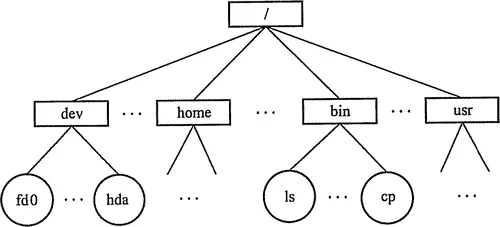
将两级目录结构的层次关系加以推广，就形成了多级目录结构，即树形目录结构。
用户要访问某个文件时用文件的路径名标识文件，文件路径名是个字符串，由从根目录出发到所找文件的通路上的所有目录名与数据文件名用分隔符链接起来而成。
从根目录出发的路径称绝对路径。当层次较多时，每次从根目录查询浪费时间，于是加入了当前目录，进程对各文件的访问都是相对于当前目录进行的。
当用户要访问某个文件时，使用相对路径标识文件，相对路径由从当前目录出发到所找文件通路上所有目录名与数据文件名用分隔符 / 链接而成。
**树形目录结构可以很方便地对文件进行分类，层次结构清晰，也能够更有效地进行文件的管理和保护。
但是，在树形目录中查找一个文件，需要按路径名逐级访问中间结点，这就增加了磁盘访问次数，无疑将影响查询速度。**

4. **无环图目录结构**
树形目录结构可便于实现文件分类，但不便于实现文件共享，为此在树形目录结构的基础上增加了一些指向同一结点的有向边，使整个目录成为一个有向无环图。
引入无环图目录结构是为了实现文件共享。
当某用户要求删除一个共享结点时，若系统只是简单地将它删除，当另一共享用户需要访问时，却无法找到这个文件而发生错误。
为此可以为每个共享结点设置一个共享计数器，每当图中增加对该结点的共享链时，计数器加 1;
每当某用户提出删除该结点时，计数器减1。仅当共享计数器为0时，才真正删除该结点，否则仅删除请求用户的共享链。
共享文件（或目录）不同于文件拷贝（副本）。
如果有两个文件拷贝，每个程序员看到的是拷贝而不是原件；但如果一个文件被修改，那么另一个程序员的拷贝不会有改变。对于共享文件，只存在一个真正文件，任何改变都会为其他用户所见。
无环图目录结构方便实现了文件的共享,但使得系统的管理变得更加复杂。

### 文件共享
#### 基于索引结点的共享方式（硬链接）
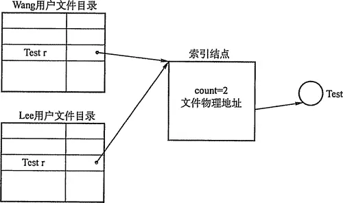
在树形结构的目录中，当有两个或多个用户要共享一个子目录或文件时，必须将共享文件或子目录链接到两个或多个用户的目录中，才能方便地找到该文件，在这种共享方式中引用索引结点，即诸如文件的物理地址及其他的文件属性等信息，不再是放在目录项中，而是放在索引结点中。
在文件目录中只设置文件名及指向相应索引结点的指针。在索引结点中还应有一个链接计数count,用于表示链接到本索引结点（亦即文件） 上的用户目录项的数目。
当count=2时，表示有两个用户目录项链接到本文件上，或者说是有两个用户共享此文件。
当用户A创建一个新文件时，它便是该文件的所有者，此时将count置为1。
当有用户 B要共享此文件时，在用户B的目录中增加一个目录项，并设置一指针指向该文件的索引结点。
此时，文件主仍然是用户A，count=2。如果用户A不再需要此文件，不能将文件直接删除。
因为，若删除了该文件，也必然删除了该文件的索引结点，这样便会便用户B的指针悬空，而用户B则可能正在此文件上执行写操作，此时用户B会无法访问到文件。
因此用户A不能删除此文件，只是将该文件的count减1，然后删除自己目录中的相应目录项。用户B仍可以使用该文件。
当Count=0时，表示没有用户使用该文件，系统将负责删除该文件。

####  利用符号链实现文件共享（软链接）
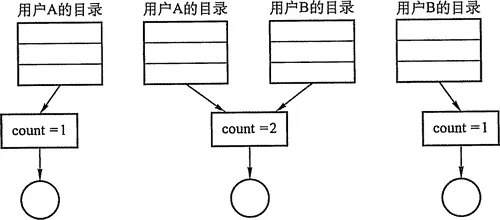
为使用户B能共享用户A的一个文件F,可以由系统创建一个LINK类型的新文件，也取名为F，并将文件F写入用户B的目录中，以实现用户B的目录与文件F的链接。
在新文件中只包含被链接文件F的路径名。这样的链接方法被称为符号链接。 
新文件中的路径名则只被看做是符号链，当用户B要访问被链接的文件F且正要读 LINK类新文件时，操作系统根据新文件中的路径名去读该文件，从而实现了用户B对文件 F的共享。
在利用符号链方式实现文件共享时，只有文件的拥有者才拥有指向其索引结点的指针。
而共享该文件的其他用户则只有该文件的路径名，并不拥有指向其索引结点的指针。
这样，也就不会发生在文件主删除一共享文件后留下一悬空指针的情况。当文件的拥有者把一个共享文件删除后，其他用户通过符号链去访问它时，会出现访问失败，于是将符号链删除，此时不会产生任何影响。当然，利用符号链实现文件共享仍然存在问题，例如：一个文件釆用符号链方式共享，当文件拥有者将其删除，而在共享的其他用户使用其符号链接访问该文件之前，又有人在同一路径下创建了另一个具有同样名称的文件，则该符号链将仍然有效，但访问的文件已经改变，从而导致错误。
在符号链的共享方式中，当其他用户读共享文件时，需要根据文件路径名逐个地查找目录，直至找到该文件的索引结点。因此，每次访问时，都可能要多次地读盘，使得访问文件的开销变大并增加了启动磁盘的频率。此外，符号链的索引结点也要耗费一定的磁盘空间。符号链方式有一个很大的优点，即网络共享只需提供该文件所在机器的网络地址以及该机器中的文件路径即可。
**上述两种链接方式都存在一个共同的问题，即每个共享文件都有几个文件名。换言之，每增加一条链接，就增加一个文件名。这实质上就是每个用户都使用自己的路径名去访问共享文件。当我们试图去遍历整个文件系统时，将会多次遍历到该共享文件。**
硬链接和软链接都是文件系统中的静态共享方法，在文件系统中还存在着另外的共享需求，即两个进程同时对同一个文件进行操作，这样的共享可以称为动态共享。

### 文件保护
为了防止文件共享可能会导致文件被破坏或未经核准的用户修改文件，文件系统必须控制用户对文件的存取，即解决对文件的读、写、执行的许可问题。
为此，必须在文件系统中建立相应的文件保护机制。
文件保护通过口令保护、加密保护和访问控制等方式实现。
其中，口令保护和加密保护是为了防止用户文件被他人存取或窃取，而访问控制则用于控制用户对文件的访问方式。
#### 访问类型
对文件的保护可以从限制对文件的访问类型中出发。可加以控制的访问类型主要有以下几种：
读：从文件中读。
写：向文件中写。
执行：将文件装入内存并执行。
添加：将新信息添加到文件结尾部分。
删除：删除文件，释放空间。
列表清单：列出文件名和文件属性。
此外还可以对文件的重命名、复制、编辑等加以控制。
这些高层的功能可以通过系统程序调用低层系统调用来实现。保护可以只在低层提供。
例如，复制文件可利用一系列的读请求来完成。这样，具有读访问用户同时也具有复制和打印的权限了。
#### 访问控制
解决访问控制最常用的方法是根据用户身份进行控制。
而实现基于身份访问的最为普通的方法是为每个文件和目录增加一个访问控制列表(Access-Control List, ACL)，以规定每个用户名及其所允许的访问类型。
这种方法的优点是可以使用复杂的访同方法。其缺点是长度无法预期并且可能导致复杂的空间管理，使用精简的访问列表可以解决这个问题。
精简的访问列表釆用拥有者、组和其他三种用户类型。
1. 拥有者：创建文件的用户。

2. 组：一组需要共享文件且具有类似访问的用户。

3. 其他：系统内的所有其他用户。

这样只需用三个域列出访问表中这三类用户的访问权限即可。
文件拥有者在创建文件时，说明创建者用户名及所在的组名，系统在创建文件时也将文件主的名字、所属组名列在该文件的FCB中。
用户访问该文件时，按照拥有者所拥有的权限访问文件，如果用户和拥有者在同一个用户组则按照同组权限访问，否则只能按其他用户权限访问。UNIX操作系统即釆用此种方法。
口令和密码是另外两种访问控制方法。
1. 口令指用户在建立一个文件时提供一个口令，系统为其建立FCB时附上相应口令，同时告诉允许共享该文件的其他用户。
用户请求访问时必须提供相应口令。这种方法时间和空间的开销不多，缺点是口令直接存在系统内部，不够安全。
2. 密码指用户对文件进行加密，文件被访问时需要使用密钥。
这种方法保密性强，节省了存储空间，不过编码和译码要花费一定时间。

口令和密码都是防止用户文件被他人存取或窃取，并没有控制用户对文件的访问类型。
### 文件系统层次结构
现代操作系统有多种文件系统类型（如FAT32、NTFS、 ext2、ext3、ext4等），因此文件系统的层次结构也不尽相同。
如下是一种常见的文件系统层次结构。
1. I/O控制层
包括设备驱动程序和中断处理程序，在内存和硬盘系统之间传递信息。设备驱动程序将输入的命令翻译成底层硬件的特定指令。硬件控制器利用这些指令使I/O设备与系统互动。
2. 基本文件系统
向对应的设备驱动发送通用命令，以读取和写入磁盘的物理块。该层也有缓存区，包括文件系统、目录、数据块的缓存。
3. 文件组织模块
文件组织模块将逻辑地址转化为物理地址。
4. 逻辑文件系统。
用于管理文件系统中的元数据信息。元数据包括文件系统的所有结构。

### 文件系统布局
#### 文件系统在磁盘中的结构
文件系统存放在磁盘上，多数磁盘划分为一个或多个分区，每个分区中有一个独立的文件系统。简单描述如下：
1. 主引导记录(MBR)位于磁盘0号扇区，用来引导计算机。MBR后面是分区表，该表给出每个分区的起始和截至地址。
2. 引导块。每个分区都是从统一的引导块开始。
3. 超级块。包含文件系统的所有信息。在计算机启动时，或者文件系统使用时，被引导进磁盘。
4. **空闲块的信息**。有以下几种管理方法：
	1. 空闲表法
	空闲表法属于连续分配方式，它与内存的动态分配方式类似，为每个文件分配一块连续的存储空间。
	系统为外存上的所有空闲区建立一张空闲盘块表，每个空闲区对应于一个空闲表项，其中包括表项序号、该空闲区第一个盘块号、该区的空闲盘块数等信息。再将所有空闲区按其起始盘块号递增的次序排列。
	空闲盘区的分配与内存的动态分配类似，同样是釆用首次适应算法、循环首次适应算法等。
	例如，在系统为某新创建的文件分配空闲盘块时，先顺序地检索空闲盘块表的各表项，直至找到第一个其大小能满足要求的空闲区，再将该盘区分配给用户，同时修改空闲盘块表。
	系统在对用户所释放的存储空间进行回收时，也釆取类似于内存回收的方法，即要考虑回收区是否与空闲表中插入点的前区和后区相邻接，对相邻接者应予以合并。
	2. 空闲链表法
	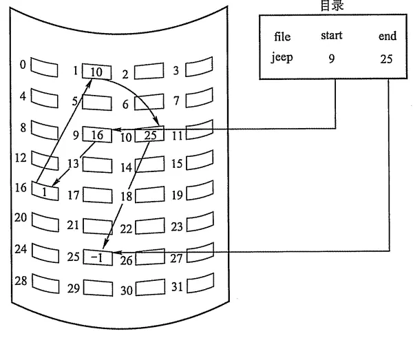
	将所有空闲盘区拉成一条空闲链，根据构成链所用的基本元素不同，可把链表分成两种形式：空闲盘块链和空闲盘区链。
	空闲盘块链是将磁盘上的所有空闲空间，以盘块为单位拉成一条链。
	当用户因创建文件而请求分配存储空间时，系统从链首开始，依次摘下适当的数目的空闲盘块分配给用户。
	当用户因删除文件而释放存储空间时，系统将回收的盘块依次插入空闲盘块链的末尾。
	这种方法的优点是分配和回收一个盘块的过程非常简单，但在为一个文件分配盘块时，可能要重复多次操作。
	空闲盘区链是将磁盘上的所有空闲盘区（每个盘区可包含若干个盘块）拉成一条链。
	在每个盘区上除含有用于指示下一个空闲盘区的指针外，还应有能指明本盘区大小（盘块数）的信息。
	分配盘区的方法与内存的动态分区分配类似，通常釆用首次适应算法。在回收盘区时，同样也要将回收区与相邻接的空闲盘区相合并。
	3. 位示图法
	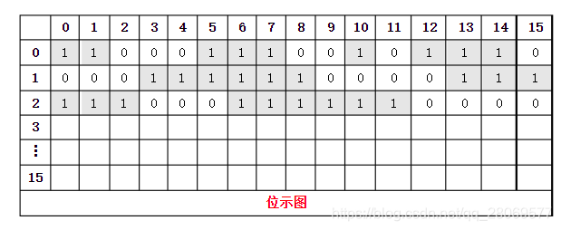
	位示图是利用二进制的一位来表示磁盘中一个盘块的使用情况，磁盘上所有的盘块都有一个二进制位与之对应。
	当其值为“0”时，表示对应的盘块空闲；当其值为“1”时，表示 对应的盘块已分配。
	盘块的分配：
	顺序扫描位示图，从中找出一个或一组其值为“0”的二进制位。
	将所找到的一个或一组二进制位，转换成与之对应的盘块号。
	假定找到的其值为“0” 的二进制位，位于位示图的第i行、第j列，则其相应的盘块号应按下式计算（n代表每行 的位数）：
	$$b = n (i-1) + j$$

	4. 成组链接法
	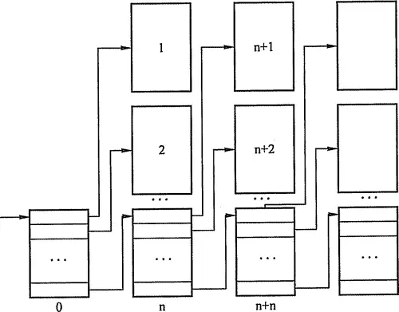
	空闲表法和空闲链表法都不适合用于大型文件系统，因为这会使空闲表或空闲链表太大。
	在UNIX系统中釆用的是成组链接法，这种方法结合了空闲表和空闲链表两种方法，克服了表太大的缺点。
	其大致的思想是:把顺序的n个空闲扇区地址保存在第一个空闲扇区内，其后一个空闲扇区内则保存另一顺序空闲扇区的地址，如此继续，直至所有空闲扇区均予以链接。
	系统只需要保存一个指向第一个空闲扇区的指针。
	表示文件存储器空闲空间的“位向量”表或第一个成组链块以及卷中的目录区、文件区划分信息都需要存放在辅存储器中，一般放在卷头位置，在UNIX系统中称为“超级块”。
	在对卷中文件进行操作前，“超级块”需要预先读入系统空间的主存，并且经常保持主存“超级块”与辅存卷中“超级块”的一致性。
### 虚拟文件系统 VFS
*“要死了，文件管理怎么那么多东西”*
不同的外存设备支持的文件系统不同，例如：（UNIX）磁盘支持UFS文件系统、移动硬盘支持NTFS文件系统、U盘支持FAT文件系统等。
不同的文件系统定义的函数接口可能不同（函数名不同，参数不同等）。
不同的文件系统存放文件信息的数据结构可能不同（有些使用索引节点inode）。
**操作系统内核提供虚拟文件系统，为用户程序提供统一的文件系统操作接口，屏蔽各不同文件系统的差异和操作细节。**
虚拟文件系统定义了如下的四种对象：
1. 超级块对象
2. 索引节点对象
3. 目录项对象
4. 文件对象
来实现对用户的统一文件接口。
### 磁盘和磁盘的一些算法
#### 结构
磁盘(Disk)是由表面涂有磁性物质的金属或塑料构成的圆形盘片，通过一个称为磁头的导体线圈从磁盘中存取数据。
在读/写操作期间，磁头固定，磁盘在下面高速旋转。
磁盘的盘面上的数据存储在一组同心圆中，称为磁道。每个磁道与磁头一样宽, 一个盘面有上千个磁道。磁道又划分为几百个扇区，每个扇区固定存储大小(通常为512B), 一个扇区称为一个盘块。相邻磁道及相邻扇区间通过一定的间隙分隔开，以避免精度错误。
注意，由于扇区按固定圆心角度划分，所以密度从最外道向里道增加，磁盘的存储能力受限于最内道的最大记录密度。
磁盘安装在一个磁盘驱动器中，它由磁头臂、用于旋转磁盘的主轴和用于数据输入/输 出的电子设备组成。
所有盘片上相对位置相同 的磁道组成柱面。按照这种物理结构组织，扇区就是磁盘可寻址的最小存储单位，磁盘地址 用“柱面号 • 盘面号 • 扇区号（或块号）”表示。 
#### 磁盘算法 （重要的咧~）
1. 先来先服务(First Come First Served, FCFS)算法
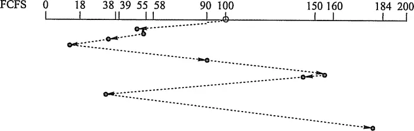
FCFS算法根据进程请求访问磁盘的先后顺序进行调度，这是一种最简单的调度算法。如果只有少量进程需要访问，且大部分请求都是访问簇聚的文件扇区，则有望达到较好的性能；但如果有大量进程竞争使用磁盘，那么这种算法在性能上往往接近于随机调度。
2.  最短寻找时间优先(Shortest Seek Time First, SSTF)算法
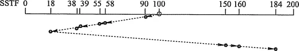
SSTF算法选择调度处理的磁道是与当前磁头所在磁道距离最近的磁道，以使每次的寻找时间最短。
当然，总是选择最小寻找时间并不能保证平均寻找时间最小，但是能提供比 FCFS算法更好的性能。
这种算法会产生“饥饿”现象。
3. 扫描(SCAN)算法（又称电梯算法）

SCAN算法在磁头当前移动方向上选择与当前磁头所在磁道距离最近的请求作为下一次服务的对象。
由于磁头移动规律与电梯运行相似，故又称为电梯调度算法。SCAN算法对最近扫描过的区域不公平，因此，它在访问局部性方面不如FCFS算法和 SSTF算法好。
4. 循环扫描(Circulair SCAN, C-SCAN)算法
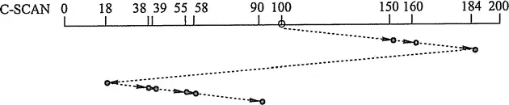
在扫描算法的基础上规定磁头单向移动来提供服务，回返时直接快速移动至起始端而不服务任何请求。
由于SCAN算法偏向于处理那些接近最里或最外的磁道的访问请求，所以使用改进型的C-SCAN算法来避免这个问题。

***
## 八、IO
*“知识不能替代友谊，比起失去你，我宁愿做个白痴 。--派大星”*
### I/O设备及其分类
I/O设备管理是操作系统设计中最凌乱也最具挑战性的部分。
由于它包含了很多领域的不同设备以及与设备相关的应用程序，因此很难有一个通用且一致的设计方案。
所以在理解设备管理之前，应该先了解具体的I/O设备类型。
1. 特性分类
	计算机系统中的I/O设备按使用特性可分为以下类型：
	1) 人机交互类外部设备：用于同计算机用户之间交互的设备，如打印机、显示器、鼠标、键盘等。这类设备数据交换速度相对较慢，通常是以字节为单位进行数据交换。
	2) 存储设备：用于存储程序和数据的设备，如磁盘、磁带、光盘等。这类设备用于数据交换，速度较快，通常以多字节组成的块为单位进行数据交换。
	3) 网络通信设备：用于与远程设备通信的设备，如各种网络接口、调制解调器等。其速度介于前两类设备之间。网络通信设备在使用和管理上与前两类设备也有很大不同。
2. 按传输速率分类：
	低速设备：传输速率仅为每秒几个到数百个字节的一类设备，如键盘、鼠标等。 中速设备：传输速率在每秒数千个字节至数万个字节的一类设备，如行式打印机、 激光打印机等。 高速设备：传输速率在数百个千字节至千兆字节的一类设备，如磁带机、磁盘机、 光盘机等。
3. 按信息交换的单位分类：
	块设备：由于信息的存取总是以数据块为单位，所以存储信息的设备称为块设备。它属于有结构设备，如磁盘等。磁盘设备的基本特征是传输速率较高，以及可寻址，即对它可随机地读/写任一块。
	字符设备：用于数据输入/输出的设备为字符设备，因为其传输的基本单位是字符。它属于无结构类型，如交互式终端机、打印机等。它们的基本特征是传输速率低、不可寻址，并且在输入/输出时常釆用中断驱动方式。
### I/O(输入/输出)控制方式
这块大量涉及计算机组成原理的内容，想必你都应该掌握了。就不过多介绍了。
1.  程序直接控制方式
对读入的每个字，CPU需要对外设状态进行循环检查，直到确定该字已经在I/O控制器的数据寄存器中。
程序直接控制方式虽然简单易于实现，但是其缺点也是显而易见的，由于cpu和I/O设备只能串行工作，导致CPU的利用率相当低。
2. 中断驱动方式
中断驱动方式的思想是，允许I/O设备主动打断CPU的运行并请求服务，从而“解放”CPU，使得其向I/O控制器发送读命令后可以继续做其他有用的工作。中断驱动方式比程序直接控制方式有效，但由于数据中的每个字在存储器与I/O控制器之间的传输都必须经过CPU,这就导致了中断驱动方式仍然会消耗较多的CPU时间。
3. **DMA方式**
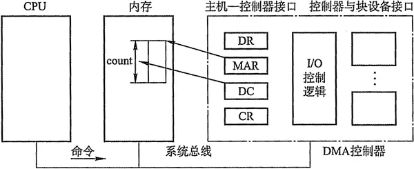
多看看这个没坏处
在中断驱动方式中，I/O设备与内存之间的数据交换必须要经过CPU中的寄存器，所以速度还是受限，而DMA（直接存储器存取）方式的基本思想是在I/O设备和内存之间开辟直接的数据交换通路，彻底“解放” CPU。DMA方式的特点是：
	1. 基本单位是数据块。
	2. 所传送的数据，是从设备直接送入内存的，或者相反。

仅在传送一个或多个数据块的开始和结束时，才需CPU干预，整块数据的传送是在 DMA控制器的控制下完成的。
DMA控制方式与中断驱动方式的主要区别是中断驱动方式在每个数据需要传输时中断CPU，**而DMA控制方式则是在所要求传送的一批数据全部传送结束时才中断CPU**；此外，中断驱动方式数据传送是在中断处理时由CPU控制完成的，而DMA控制方式则是在DMA 控制器的控制下完成的。
4. 通道控制方式
I/O通道是指专门负责输入/输出的处理机。I/O通道方式是DMA方式的发展，它可以进一步减少CPU的干预，即把对一个数据块的读（或写）为单位的干预，减少为对一组数据块的读（或写）及有关的控制和管理为单位的干预。同时，又可以实现CPU、通道和I/O设备三者的并行操作，从而更有效地提高整个系统的资源利用率。
**I/O通道与DMA方式的区别是：DMA方式需要CPU来控制传输的数据块大小、传输的内存位置，而通道方式中这些信息是由通道控制的。**

### I/O子系统的层次结构
*“我只能送你到这儿了，剩下的路你要自己走，不要回头。”*

这一块**很重要**哦，请仔细复习。
I/O软件涉及的面非常广，往下与硬件有着密切的联系，往上又与用户直接交互，它与进程管理、存储器管理、文件管理等都存在着一定的联系，即它们都可能需要I/O软件来实现I/O操作。
为了使复杂的I/O软件具有清晰的结构，良好的可移植性和适应性，在I/O软件中普遍釆用了层次式结构，将系统输入/输出功能组织成一系列的层次，每一层都利用其下层提供的服务，完成输入/输出功能中的某些子功能，并屏蔽这些功能实现的细节，向高层提供服务。
在层次式结构的I/O软件中，只要层次间的接口不变，对某一层次中的软件的修改都不会引起其下层或高层代码的变更，仅最底层才涉及硬件的具体特性。
整个I/O系统可以看成具有四个层次的系统结构，各层次及其功能如下：
#### 用户层I/O软件
实现与用户交互的接口，用户可直接调用在用户层提供的、与I/O操作有关的库函数，对设备进行操作。
一般而言，大部分的I/O软件都在操作系统内部，但仍有一小部分在用户层，包括与用户程序链接在一起的库函数，以及完全运行于内核之外的一些程序。
用户层软件必须通过一组系统调用来获取操作系统服务。

####  设备独立性软件
用于实现用户程序与设备驱动器的统一接口、设备命令、设备保护、以友设备分配与释放等，同时为设备管理和数据传送提供必要的存储空间。
设备独立性也称设备无关性，使得应用程序独立于具体使用的物理设备。为了实现设备独立性而引入了逻辑设备和物理设备这两个概念。
在应用程序中，使用逻辑设备名来请求使用某类设备；而在系统实际执行时，必须将逻辑设备名映射成物理设备名使用。
使用逻辑设备名的好处是：

1. 增加设备分配的灵活性；

2. 易于实现I/O重定向，所谓I/O重定向，是指用于I/O操作的设备可以更换（即重定向），而不必改变应用程序。

3. 为了实现设备独立性，必须再在驱动程序之上设置一层设备独立性软件。

总的来说，设备独立性软件的主要功能可分以为以下两个方面：

1. 执行所有设备的公有操作。包括：对设备的分配与回收；将逻辑设备名映射为物理设备名；对设备进行保护，禁止用户直接访问设备；缓冲管理；差错控制；提供独立于设备的大小统一的逻辑块，屏蔽设备之间信息交换单位大小和传输速率的差异。

2. 向用户层（或文件层）提供统一接口。无论何种设备，它们向用户所提供的接口应该是相同的。例如，对各种设备的读/写操作，在应用程序中都统一使用read/write命令等。

#### 设备驱动程序
与硬件直接相关，负责具体实现系统对设备发出的操作指令，驱动 I/O设备工作的驱动程序。
通常，每一类设备配置一个设备驱动程序，它是I/O进程与设备控制器之间的通信程序，常以进程形式存在。
设备驱动程序向上层用户程序提供一组标准接口，设备具体的差别被设备驱动程序所封装，用于接收上层软件发来的抽象I/O要求，如read和write命令，转换为具体要求后，发送给设备控制器，控制I/O设备工作；它也将由设备控制器发来的信号传送给上层软件。
从而为I/O内核子系统隐藏设备控制器之间的差异。

#### 中断处理程序：
用于保存被中断进程的CPU环境，转入相应的中断处理程序进行处理，处理完并恢复被中断进程的现场后，返回到被中断进程。
中断处理层的主要任务有：进行进程上下文的切换，对处理中断信号源进行测试，读取设备状态和修改进程状态等。
由于中断处理与硬件紧密相关，对用户而言，应尽量加以屏蔽，故应放在操作系统的底层，系统的其余部分尽可能少地与之发生联系。

#### 硬件设备
 I/O设备通常包括一个机械部件和一个电子部件。为了达到设计的模块性和通用性，一般将其分开：电子部件称为设备控制器（或适配器），在个人计算机中，通常是一块插入主板扩充槽的印刷电路板；机械部件则是设备本身。
设备控制器通过寄存器与CPU通信，在某些计算机上，这些寄存器占用内存地址的一部分，称为内存映像I/O；另一些计算机则釆用I/O专用地址，寄存器独立编址。
操作系统通过向控制器寄存器写命令字来执行I/O功能。控制器收到一条命令后，CPU可以转向进行其他工作，而让设备控制器自行完成具体的I/O操作。
当命令执行完毕后，控制器发出一个中断信号，操作系统重新获得CPU的控制权并检查执行结果，此时，CPU仍旧是从控制器寄存器中读取信息来获得执行结果和设备的状态信息。
设备控制器的主要功能为：

1. 接收和识别CPU或通道发来的命令，如磁盘控制器能接收读、写、查找等命令。

2. 实现数据交换，包括设备和控制器之间的数据传输；通过数据总线或通道，控制器和主存之间的数据传输。

3. 发现和记录设备及自身的状态信息，供CPU处理使用。

4. 设备地址识别。
### 缓存
#### 高速缓存
操作系统中使用磁盘高速缓存技术来提高磁盘的I/O速度，对高速缓存复制的访问要比原始数据访问更为高效。

例如，正在运行的进程的指令既存储在磁盘上，也存储在物理内存上，也被复制到CPU的二级和一级高速缓存中。

不过，磁盘高速缓存技术不同于通常意义下的介于CPU与内存之间的小容量高速存储器，而是指利用内存中的存储空间来暂存从磁盘中读出的一系列盘块中的信息。

因此，磁盘高速缓存在逻辑上属于磁盘，物理上则是驻留在内存中的盘块。

高速缓存在内存中分为两种形式：一种是在内存中开辟一个单独的存储空间作为磁速缓存，大小固定；另一种是把未利用的内存空间作为一个缓沖池，供请求分页系统和磁盘I/O时共享。
#### 缓存区
在设备管理子系统中，引入缓冲区的目的主要有：

1. 缓和CPU与I/O设备间速度不匹配的矛盾。

2. 减少对CPU的中断频率，放宽对CPU中断响应时间的限制。

3. 解决基本数据单元大小（即数据粒度）不匹配的问题。

4. 提高CPU和I/O设备之间的并行性。

其实现方法有：

1. 釆用硬件缓冲器，但由于成本太高，除一些关键部位外，一般不釆用硬件缓冲器

2. 釆用缓冲区（位于内存区域）。
根据系统设置缓冲器的个数，缓冲技术可以分为：

设数据从IO设备移动到缓存区的时间为T，缓存区到工作区的时间为M，工作区处理时间为C。
##### 单缓冲


在设备和处理机之间设置一个缓冲区。设备和处理机交换数据时，先把被交换数据写入缓冲区，然后需要数据的设备或处理机从缓冲区取走数据。

在块设备输入时，假定从磁盘把一块数据输入到缓冲区的时间为T，操作系统将该缓冲区中的数据传送到用户区的时间为M，而CPU对这一块数据处理的时间为 C。

由于T和C是可以并行的，当T>C时，系统对每一块数据的处理时间为M十T，反之则为M+C，故可把系统对每一块数据的处理时间表示为 
$$Max(C, T)+M$$
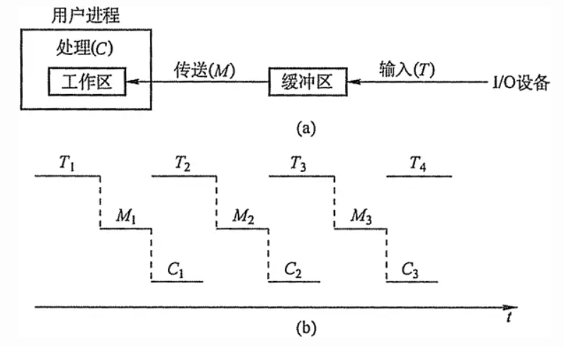
##### 双缓冲
根据单缓冲的特点，CPU在传送时间M内处于空闲状态，由此引入双缓冲。
I/O设备输入数据时先装填到缓冲区1，在缓冲区1填满后才开始装填缓冲区2，与此同时处理机可以从缓冲区1中取出数据放入用户进程处理，当缓冲区1中的数据处理完后，若缓冲区2已填满，则处理机又从缓冲区2中取出数据放入用户进程处理，而I/O设备又可以装填缓冲区1。
双缓冲机制提高了处理机和输入设备的并行操作的程度。
系统处理一块数据的时间可以粗略地认为是MAX(C+M, T)。
如果 C < T，可使块设备连续输入；
如果 C > T，则可使CPU不必等待设备输入。
对于字符设备，若釆用行输入方式，则釆用双缓冲可使用户在输入完第一行之后，在CPU执行第一行中的命令的同时，用户可继续向第二缓冲区输入下一行数据。
而单缓冲情况下则必须等待一行数据被提取完毕才可输入下一行的数据。
总结：双缓冲的每块数据平均时间
$$MAX(C+M,T)$$
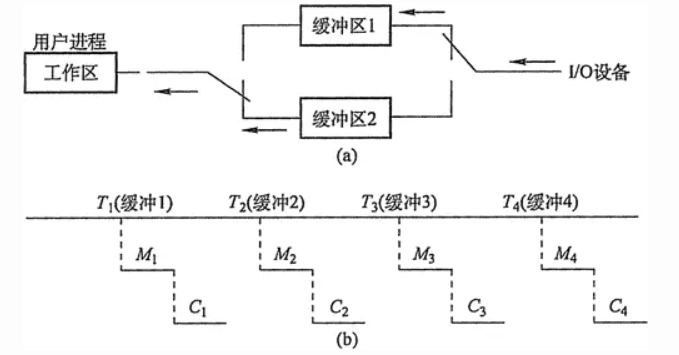

##### 循环缓冲
包含多个大小相等的缓冲区，每个缓冲区中有一个链接指针指向下一个缓冲区，最后一个缓冲区指针指向第一个缓冲区，多个缓冲区构成一个环形。
循环缓冲用于输入/输出时，还需要有两个指针in和out。
对输入而言，首先要从设备接收数据到缓冲区中，in指针指向可以输入数据的第一个空缓冲区；当运行进程需要数据时，从循环缓冲区中取一个装满数据的缓冲区，并从此缓冲区中提取数据，out指针指向可以提取数据的第一个满缓冲区。输出则正好相反。

##### 缓冲池
由多个系统公用的缓冲区组成，缓冲区按其使用状况可以形成三个队列：空缓冲队列、装满输入数据的缓冲队列（输入队列）和装满输出数据的缓沖队列（输出队列）。还应具有四种缓冲区：用于收容输入数据的工作缓冲区、用于提取输入数据的工作缓冲区、 用于收容输出数据的工作缓冲区及用于提取输出数据的工作缓冲区。
当输入进程需要输入数据时，便从空缓冲队列的队首摘下一个空缓冲区，把它作为收容输入工作缓冲区，然后把输入数据输入其中，装满后再将它挂到输入队列队尾。

当计算进程需要输入数据时，便从输入队列取得一个缓冲区作为提取输入工作缓冲区，计算进程从中提取数据，数据用完后再将它挂到空缓冲队列尾。

当计算进程需要输出数据时，便从空缓冲队列的队首取得一个空缓冲区，作为收容输出工作缓冲区，当其中装满输出数据后，再将它挂到输出队列队尾。

当要输出时，由输出进程从输出队列中取得一个装满输出数据的缓冲区，作为提取输出工作缓冲区，当数据提取完后，再将它挂到空缓冲队列的队尾。
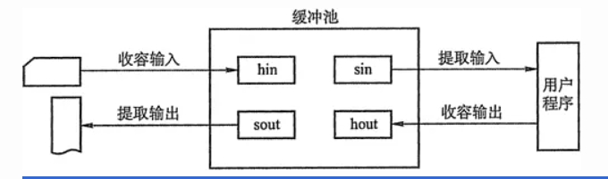
### 高速缓存与缓存区对比

### 输入/输出(I/O)设备分配与回收
####  设备分配概述
设备分配是指根据用户的I/O请求分配所需的设备。分配的总原则是充分发挥设备的使用效率，尽可能地让设备忙碌，又要避免由于不合理的分配方法造成进程死锁。
从设备的特性来看，釆用下述三种使用方式的设备分别称为独占设备、共享设备和虚拟设备三类。

1) 独占式使用设备。指在申请设备时，如果设备空闲，就将其独占，不再允许其他进程申请使用，一直等到该设备被释放才允许其他进程申请使用。例如，打印机，在使用它打印时，只能独占式使用，否则在同一张纸上交替打印不同任务的内容，无法正常阅读。

2) 分时式共享使用设备。独占式使用设备时，设备利用率很低，当设备没有独占使用的要求时，可以通过分时共享使用，提高利用率。例如，对磁盘设备的I/O操作，各进程的每次I/O操作请求可以通过分时来交替进行。

3) 以SPOOLing方式使用外部设备。SPOOLing技术是在批处理操作系统时代引入的，即假脱机I/O技术。这种技术用于对设备的操作，实质上就是对I/O操作进行批处理。

#### 设备分配的数据结构
设备分配依据的主要数据结构有设备控制表(DCT)、控制器控制表(COCT)、通道控制表(CHCT)和系统设备表(SDT)，各数据结构功能如下：
1. 设备控制表DCT：系统为每一个设备配置一张DCT。
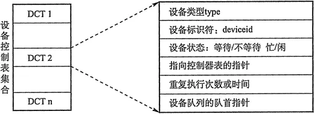
它用于记录设备的特性以及与I/O控制器连接的情况。DCT包括设备标识符、设备类型、设备状态、指向控制器控制表COCT的指针等。
其中，设备状态指示设备是忙还是空闲，设备队列指针指向等待使用该设备的进程组成的等待队列，控制表指针指向与该设备相连接的设备控制器。
2. 控制器控制表COCT：每个控制器都配有一张COCT，如图5-10a所示。它反映设备控制器的使用状态以及和通道的连接情况等。
3. 通道控制表CHCT：每个通道配有一张CHCT，如图5-10b所示。
4. 系统设备表SDT：整个系统只有一张SDT，如图5-10c所示。它记录已连接到系统中的所有物理设备的情况，每个物理设备占一个表目。
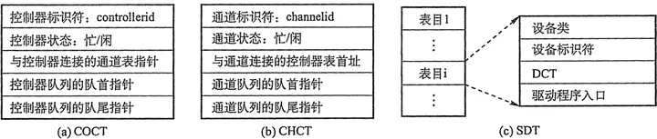
#### 设备分配的策略
1) 设备分配原则：设备分配应根据设备特性、用户要求和系统配置情况。分配的总原则既要充分发挥设备的使用效率，又要避免造成进程死锁，还要将用户程序和具体设备隔离开。

2) 设备分配方式：设备分配方式有静态分配和动态分配两种。
静态分配主要用于对独占设备的分配，它在用户作业开始执行前，由系统一次性分配该作业所要求的全部设备、控制器（和通道)。一旦分配后，这些设备、控制器（和通道）就一直为该作业所占用，直到该作业被撤销。静态分配方式不会出现死锁，但设备的使用效率低。因此，静态分配方式弁不符合分配的总原则。
动态分配是在进程执行过程中根据执行需要进行。当进程需要设备时，通过系统调用命令向系统提出设备请求，由系统按照事先规定的策略给进程分配所需要的设备、I/O控制器，一旦用完之后，便立即释放。动态分配方式有利于提高设备的利用率，但如果分配算法使用不当，则有可能造成进程死锁。

3) 设备分配算法：常用的动态设备分配算法有先请求先分配、优先级高者优先等。

对于独占设备，既可以釆用动态分配方式也可以静态分配方式，往往釆用静态分配方式，即在作业执行前，将作业所要用的这一类设备分配给它。共享设备可被多个进程所共享，一般釆用动态分配方式，但在每个I/O传输的单位时间内只被一个进程所占有，通常釆用先请求先分配和优先级高者先分的分配算法。
#### 设备分配的安全性
设备分配的安全性是指设备分配中应防止发生进程死锁。
1) 安全分配方式：每当进程发出I/O请求后便进入阻塞状态，直到其I/O操作完成时才被唤醒。这样，一旦进程已经获得某种设备后便阻塞，不能再请求任何资源，而且在它阻塞时也不保持任何资源。i点是设备分配安全；缺点是CPU和I/O设备是串行工作的（对同一进程而言)。
2) 不安全分配方式：进程在发出I/O请求后继续运行，需要时又发出第二个、第三个 I/O请求等。仅当进程所请求的设备已被另一进程占用时，才进入阻塞状态。优点是一个进程可同时操作多个设备，从而使进程推进迅速；缺点是这种设备分配有可能产生死锁。
####  逻辑设备名到物理设备名的映射
为了提高设备分配的灵活性和设备的利用率、方便实现I/O重定向，因此引入了设备独立性。设备独立性是指应用程序独立于具体使用的物理设备。

为了实现设备独立性，在应用程序中使用逻辑设备名来请求使用某类设备，在系统中设置一张逻辑设备表(Logical Unit Table, LUT)，用于将逻辑设备名映射为物理设备名。

LUT 表项包括逻辑设备名、物理设备名和设备驱动程序入口地址；当进程用逻辑设备名来请求分配设备时，系统为它分配相应的物理设备，并在LUT中建立一个表项，以后进程再利用逻辑设备名请求I/0操作时，系统通过查找LUT来寻找相应的物理设备和驱动程序。

在系统中可釆取两种方式建立逻辑设备表：
在整个系统中只设置一张LUT。这样，所有进程的设备分配情况都记录在这张表中，故不允许有相同的逻辑设备名，主要适用于单用户系统中。
为每个用户设置一张LUT。当用户登录时，系统便为该用户建立一个进程，同时也为之建立一张LUT，并将该表放入进程的PCB中。
#### SPOOLing技术(假脱机技术)
为了缓和CPU的高速性与I/O设备低速性之间的矛盾而引入了脱机输入/输出技术。
该技术是利用专门的外围控制机，将低速I/O设备上的数据传送到高速磁盘上；或者相反。
SPOOLing的意思是外部设备同时联机操作，又称为假脱机输入/输出操作，是操作系统中釆用的一项将独占设备改造成共享设备的技术。
SPOOLing系统组成如图所示。
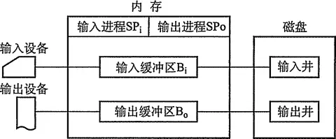
**输入井和输出井**
在磁盘上开辟出的两个存储区域。输入井模拟脱机输入时的磁盘，用于收容I/O设备输入的数据。
输出井模拟脱机输出时的磁盘，用于收容用户程序的输出数据。
**输入缓冲区和输出缓冲区**
在内存中开辟的两个缓冲区。输入缓冲区用于暂存由输入设备送来的数据，以后再传送 到输入井。输出缓冲区用于暂存从输出井送来的数据，以后再传送到输出设备。
**输入进程和输出进程**
输入进程模拟脱机输入时的外围控制机，将用户要求的数据从输入机通过输入缓冲区再送到输入井。
当CPU需要输入数据时，直接将数据从输入井读入内存。输出进程模拟脱机 输出时的外围控制机，把用户要求输出的数据先从内存送到输出并，待输出设备空闲时，再将输出井中的数据经过输出缓冲区送到输出设备。
共享打印机是使用SPOOLing技术的一个实例，这项技术已被广泛地用于多用户系统和局域网络中。
当用户进程请求打印输出时，SPOOLing系统同意为它打印输出，但并不真正立即把打印机分配给该用户进程，而只为它做两件事：
由输出进程在输出井中为之申请一个空闲磁盘块区，并将要打印的数据送入其中。
输出进程再为用户进程申请一张空白的用户请求打印表，并将用户的打印要求填入 其中，再将该表挂到请求打印队列上。
SPOOLing系统的主要特点有：提高了 I/O的速度；将独占设备改造为共享设备；实现了虚拟设备功能。
## ？TIPS区
*"你知道的，操作系用一直都是我的好朋友。我现在强的可怕，我无所不能，我所向披靡!...."*
1. 信号量的绝对值\|a\|代表的是等待该信号量的进程。比如，a=-3，则表明有3个进程在等待。
2. 死锁和饥饿的区别：死锁是互相拿对方想要的资源互相没办法，饥饿是无穷等待没有尽头。
3. 使用快表后，可以从两次访问内存次数变为一次内存访问次数。
4. 在驻留集的分配策略中，有固定分配局部置换、可变分配局部置换、可变分配全局置换。唯独**没有固定分配全局置换**，因为做不到。
5. 文件名不是打开文件表的一部分，因为一旦对FCB在磁盘上定位，系统不再为其使用文件名。WINDOWS采用文件句柄来定位文件。
6. 文件**逻辑结构**分为两种：无结构、也叫做**流式文件**和有结构、记录式文件。
7. 有结构文件的**组织形式**分为顺序文件、索引文件、顺序索引文件。
8. 文件**物理结构**的分配方式有三种：连续分配、链接分配和索引分配。
	1. 链式结构不能支持随机访问。
	2. 连续结构不方便扩展。
	3. **随机访问且易于扩展的是索引结构**。
9. 文件系统中，索引节点总数=文件总数。与单个文件长度无关。间接地址级数越多、地址项数越多、文件快越大、单个文件就越大。
10. 磁盘调度算法中，CSCAN是先到达一端，然后直接返回到另一端，再处理靠近另一端的请求。而SCAN是先到达一端，再往另一端的移动过程中处理请求。
11. DMA中，CPU仅需要在第一步初始化和最后一步DMA结束处理需要参与。一般DMA工作流程如下：预处理、数据传输、中断结束处理。
12. I/O子系统的层次结构：从上到下：用户层、设备独立层、设备驱动层、中断层、硬件层。


<参考文献>
1. [操作系统](https://houbb.github.io/2020/10/04/os-09-memory-virtul)